```{r, echo=FALSE}
knitr::opts_chunk$set(eval = FALSE)
```


# Software dependencies

* sra-toolkit (v3.0.5)
* bedtools (v2.29.1)
* bismark (v0.24.2)
* Cleaveland (v4.5)
* ViennaRNA package (v2.4.2)
* cutadapt (v4.4)
* fastx (v0.0.14)
* bowtie (1.2.1.1)
* UNITAS (v1.8.0)
* samtools (v1.9)
* trim_galore (v.0.6.10) 
* R (v4.3.2)
* seqkit (v2.5.1)


# R libraries

* DESeq2 (v1.28.1)

```{r}
library("tidyverse")
library("DESeq2")
library("ggplot2")
library("ggpubr")
library("gghighlight")
library("DESeq2")
library("Biostrings")
library("VennDiagram")

fasta_to_df <- function(path){
  fasta = readLines(path)
  ids = grepl(">", fasta)
  f = data.frame(
    id = sub(">", "", fasta[ids]),
    sequence = tapply(fasta[!ids], cumsum(ids)[!ids], function(x) {
      paste(x, collapse = "")
    }))
  return(f)
}

make_fasta <-  function(vector_sequence, path_output, sequence_names){
  if(is.vector(vector_sequence)){
    len_seq <- length(vector_sequence)
    Xfasta <- character(len_seq * 2)
    if(missing(sequence_names)){
      Xfasta[c(TRUE, FALSE)] <- paste0(">seq", 1:len_seq)
    } else {
      Xfasta[c(TRUE, FALSE)] <- paste0(">",sequence_names)
    }
    Xfasta[c(FALSE, TRUE)] <- as.character(vector_sequence)
    writeLines(Xfasta, path_output)
  } 
  else {
      stop("Argument is not a vector")
    }
}

# Source function for GO analysis
source("S:/git_repositories/GOMAP_maize_B73_NAM5/go_functions.R", chdir = T)
```

```
R version 4.0.3 (2020-10-10)
Platform: x86_64-w64-mingw32/x64 (64-bit)
Running under: Windows 10 x64 (build 19045)

Matrix products: default

locale:
[1] LC_COLLATE=English_United States.1252 
[2] LC_CTYPE=English_United States.1252   
[3] LC_MONETARY=English_United States.1252
[4] LC_NUMERIC=C                          
[5] LC_TIME=English_United States.1252    

attached base packages:
 [1] grid      parallel  stats4    stats     graphics  grDevices
 [7] utils     datasets  methods   base     

other attached packages:
 [1] VennDiagram_1.7.3           futile.logger_1.4.3        
 [3] Biostrings_2.56.0           XVector_0.28.0             
 [5] gghighlight_0.4.1           ggpubr_0.4.0               
 [7] DESeq2_1.28.1               SummarizedExperiment_1.18.2
 [9] DelayedArray_0.14.1         matrixStats_1.3.0          
[11] Biobase_2.48.0              GenomicRanges_1.40.0       
[13] GenomeInfoDb_1.24.2         IRanges_2.22.2             
[15] S4Vectors_0.26.1            BiocGenerics_0.34.0        
[17] lubridate_1.9.3             forcats_1.0.0              
[19] stringr_1.5.1               dplyr_1.1.0                
[21] purrr_0.3.4                 readr_2.1.5                
[23] tidyr_1.2.1                 tibble_3.2.1               
[25] ggplot2_3.4.1               tidyverse_2.0.0            

loaded via a namespace (and not attached):
 [1] bitops_1.0-7           bit64_4.0.5            RColorBrewer_1.1-3    
 [4] bslib_0.4.1            tools_4.0.3            backports_1.4.1       
 [7] utf8_1.2.4             R6_2.5.1               DBI_1.2.3             
[10] colorspace_2.1-0       withr_3.0.1            tidyselect_1.2.1      
[13] bit_4.0.5              compiler_4.0.3         cli_3.6.2             
[16] formatR_1.14           sass_0.4.9             labeling_0.4.3        
[19] scales_1.3.0           genefilter_1.70.0      digest_0.6.27         
[22] rmarkdown_2.25         pkgconfig_2.0.3        htmltools_0.5.2       
[25] fastmap_1.1.0          rlang_1.0.6            rstudioapi_0.17.0     
[28] RSQLite_2.3.7          jquerylib_0.1.4        farver_2.1.1          
[31] generics_0.1.3         jsonlite_1.8.8         gtools_3.9.5          
[34] vroom_1.6.5            BiocParallel_1.22.0    car_3.1-2             
[37] RCurl_1.98-1.5         magrittr_2.0.3         GenomeInfoDbData_1.2.3
[40] Matrix_1.6-5           Rcpp_1.0.12            munsell_0.5.1         
[43] fansi_1.0.6            abind_1.4-8            lifecycle_1.0.3       
[46] stringi_1.8.3          yaml_2.2.1             carData_3.0-5         
[49] zlibbioc_1.34.0        blob_1.2.4             crayon_1.5.3          
[52] lattice_0.22-6         cowplot_1.1.3          splines_4.0.3         
[55] annotate_1.66.0        hms_1.1.3              locfit_1.5-9.4        
[58] knitr_1.42             pillar_1.9.0           ggsignif_0.6.4        
[61] geneplotter_1.66.0     futile.options_1.0.1   XML_3.99-0.8          
[64] glue_1.7.0             evaluate_1.0.1         lambda.r_1.2.4        
[67] vctrs_0.5.2            tzdb_0.4.0             gtable_0.3.1          
[70] cachem_1.0.6           xfun_0.37              xtable_1.8-4          
[73] broom_1.0.7            rstatix_0.7.2          survival_3.5-8        
[76] AnnotationDbi_1.50.3   memoise_2.0.1          timechange_0.3.0   
```


# Data availability

All data can be download on NCBI (PRJNA1077103)

| accession   | library_ID       | Type      |
|-------------|------------------|-----------|
| SRR28009046 | 70SC_BS          | PBAT      |
| SRR28009045 | 84SC_BS          | PBAT      |
| SRR28009041 | 87SC_BS          | PBAT      |
| SRR28009040 | F5_rep1_sRNA     | sRNA-seq  |
| SRR28009039 | F5_rep2_sRNA     | sRNA-seq  |
| SRR28009038 | F5_rep3_sRNA     | sRNA-seq  |
| SRR28009037 | pollen_rep1_sRNA | sRNA-seq  |
| SRR28009044 | pollen_rep2_sRNA | sRNA-seq  |
| SRR28009036 | SC_rep1_sRNA     | sRNA-seq  |
| SRR28009035 | SC_rep2_sRNA     | sRNA-seq  |
| SRR28009043 | SC_rep3_sRNA     | sRNA-seq  |
| SRR28009042 | pollen_degradome | Degradome |

Download the raw fastq files using [sra-tools](https://github.com/ncbi/sra-tools/wiki) (see tutorial in https://github.com/johanzi/ncbi_tutorial).

*PBAT: Post-bisulfite adapter tagging bisulfite-sequencing.*

Download SRR_Acc_List.txt using the SRA Run selector and download the fastq files.

```{bash, eval=FALSE}
module load sratoolkit

while read name; do
        fastq-dump --split-files $name
done < SRR_Acc_List.txt

```


# sRNA analysis

## Trimming

Sperm cell and pollen data (SRR28009037, SRR28009044, SRR28009036, SRR28009035, SRR28009043). These libraries were made with NEBNext small RNA kit (NEB, cat. no. E7300).

```{bash, eval=FALSE}
cutadapt -a agatcggaagagcacacgtct --discard-untrimmed <fastq.fq.gz> | \
  cutadapt -m 18 -M 37 -o <fastq.trimmed.fq.gz> -
```

Vesicles fraction 5 (F5) data (SRR28009040, SRR28009039, SRR28009038). sRNA-seq libraries for these samples were made with the Small-seq protocol (Hagemann-Jensen et al. 2018). The trimming is different here because unique molecular identifiers (UMI) are present.

```{bash, eval=FALSE}
# Remove 3' adapter
cutadapt -a tggaattctcgggtgccaagg --discard-untrimmed <fastq.fq.gz> | \
  cutadapt -m 18 -o <fastq.trimmed.fq.gz> -

# Collapse reads with the same UMI
zcat <fastq.trimmed.fq.gz> | fastx_collapser -o <collapsed.fa>

# Remove UMI sequence
cutadapt -g ^NNNNNNNNCA --discard-untrimmed <collapsed.fa> | \
  cutadapt -m 18 -M 37 -o <collapsed.trimmed_UMI.fa> -

```


## sRNA mapping

We consider only sRNAs mapping without mismatch to the B73 NAM5 assembly (chromosomes, scaffolds, and organelles). Fasta file was obtained on https://download.maizegdb.org/Zm-B73-REFERENCE-NAM-5.0/Zm-B73-REFERENCE-NAM-5.0.fa.gz

```{bash, eval=FALSE}
# Collapse the sequences
fastx_collapser -i <input_reads> -o <collapsed.fa>

# Get B73 NAM5 genome (chromosomes and contigs)
wget https://download.maizegdb.org/Zm-B73-REFERENCE-NAM-5.0/Zm-B73-REFERENCE-NAM-5.0.fa.gz

# Get chloroplast sequence (KF241981.1, https://www.ncbi.nlm.nih.gov/nuccore/KF241981)

# Get mitochondrial sequence (AY506529.1, https://www.ncbi.nlm.nih.gov/nuccore/AY506529.1)

# Concatenate all fasta sequences
cat Zm-B73-REFERENCE-NAM-5.0.fa chloroplast.fa mitochondria.fa > NAM5_Pt_Mt.fa

# Index genome
bowtie-build -f NAM5_Pt_Mt.fa index_Zm_B73_NAM5 

# Map the reads without any mismatch allowed
bowtie -S -l 37 -n 0 -x index_Zm_B73_NAM5 --threads 8 -f <collapsed.fa> | \
  samtools sort | samtools view -b -o <mapped_reads.bam> -

```


## Select sRNAs present in at least two replicates

We selected unique sRNAs found in at least 2/3 replicates for each tissue type (2/2 for pollen B73) and perform the intersect between sperm cell and fraction 5. `fastx_collapser` collapses sequences and add the number of time a given sequence is found. Therefore, sequences with a name containing 1, 2, or 3 are found in one, two, or three replicates, respectively.

```{bash, eval=FALSE}
# Convert mapped reads from bam to fasta
samtools fasta -F 4 <mapped_reads.bam> > <mapped_reads.fa>

# Concatenate reads of all replicates
cat mapped_reads_rep1.fa mapped_reads_rep2.fa mapped_reads_rep3.fa > pooled_rep.fa

# Rename to remove previous fastx_collapser naming
seqkit replace -p .+ -r "seq_{nr}" pooled_rep.fa > pooled_rep.renamed.fa

# Collapse reads
fastx_collapser -i pooled_rep.renamed.fa -o pooled_rep.renamed.collapsed.fa

# Keep reads with at least 2 replicates (remove read with 1 in the seq name)
seqkit grep -v -r -p -1 pooled_rep.renamed.collapsed.fa \ 
  > pooled_rep.renamed.collapsed.intersect_min_2.fa

```

```{bash, eval=FALSE}
# Retrieve mapped reads and convert to fasta
for i in mapped_fasta/*bam; do
  prefix=$(basename ${i%%.*})
  samtools fasta -F 4 $i > mapped_fasta/${prefix}.mapped.fa
done

# Pool reads across replicates
## Vesicle samples
while read i; do
  cat ${i}_*.fa > pooled_replicates/${i}.mapped.fa
done < <(\ls *.mapped.fa | cut -d_ -f1 | uniq)

## SC and pollen samples
while read i; do
  cat ${i}_*.fa > pooled_replicates/${i}.mapped.fa
done < <(\ls *.mapped.fa | cut -d_ -f1-2 | uniq)


# Rename to remove previous fastx_collapser naming
for i in pooled_replicates/*fa; do
  prefix=$(basename ${i%%.*})
  seqkit replace -p .+ -r "seq_{nr}" $i > pooled_replicates/${prefix}.mapped.renamed.fa
  rm $i
done

# Collapse again
for i in pooled_replicates/*renamed.fa; do
  prefix=$(basename ${i%%.*})
  fastx_collapser -i $i -o pooled_replicates/${prefix}.collapsed.fa
done

# Retrieve reads present in at least two replicates
for i in pooled_replicates/*.collapsed.fa; do
  prefix=$(basename ${i%%.*})
  seqkit grep -v -r -p -1 $i > pooled_replicates/${prefix}.intersect_min_2.fa
done

```


## Intersect sRNAs between F5 and SC

```{bash, eval=FALSE}
# Pool unique sequences from 2 tissues
cat Fr5.intersect_min_2.fa SC_B73.intersect_min_2.fa > pooled_SC_Fr5.fa

# Rename headers
seqkit replace -p .+ -r "seq_{nr}" pooled_SC_Fr5.fa > pooled_SC_Fr5.renamed.fa
rm pooled_SC_Fr5.fa

# Collapse reads
fastx_collapser -i pooled_SC_Fr5.renamed.fa -o pooled_SC_Fr5.renamed.collapsed.fa

# Retrieve sequences that are in both tissue
seqkit grep -v -r -p -1 pooled_SC_Fr5.renamed.collapsed.fa > pooled_SC_Fr5.intersect.fa

seqkit stats pooled_SC_Fr5.intersect_min_2.fa
file                              format  type  num_seqs  sum_len  min_len  avg_len  max_len
pooled_SC_Fr5.intersect_min_2.fa  FASTA   DNA     22,408  609,987       18     27.2       37

```

22,408 common sequences found between SC and Pollen.


# Expression analysis

To perform the PCA of sRNAs expression across the three types compartments, we considered every sRNA sequence has a gene and looked at the read count across all samples. We gathered these raw read count into a matrix that can then be processed into DESeq2 as a standard gene read count matrix.

## Format data

Use collapsed reads by `fastx_collapser` which gives the sequence and the number of times it occurs in a given sample with the number of occurences within the fasta header.

Example:

```
>1-460089
TGCAAATCTAACGAAGTGCTCCTGGACG
>2-206928
CGTTATTTTACTTATTCCGTGGGTCGGAAGCGGGGCA
>3-195873
TTAACACATGCAAATCTAACGAAGTGCTCCTGGACG
```
The first sequence `TGCAAATCTAACGAAGTGCTCCTGGACG` occurs 460,089 times.

Convert the fasta format so that the number of occurrences comes right after the sequence:

```
TGCAAATCTAACGAAGTGCTCCTGGACG 460089
CGTTATTTTACTTATTCCGTGGGTCGGAAGCGGGGCA 206928
TTAACACATGCAAATCTAACGAAGTGCTCCTGGACG 195873
```

```{bash, eval=FALSE}
# Format and sort data by sequence name
for i in *.collapsed.fa; do
  prefix=$(basename ${i%%.*})
  awk -v RS='\n>' -v ORS='\n>' -v OFS='' -F'\n' '{$1=$1 "\t"}1' $i | \
          awk 'BEGIN {FS = "-"}{print $2}' | awk '{print $2"\t"$1}' | \
          sed '$ d' | sort -k1,1  > $output/${prefix}.txt
done

```

## Merge data

Merge all raw read count into one large matrix with samples in columns and sequence in rows. We used a java script that creates a bash command using the unix function `join`. The bash script is then launched and the output files are `merged_dataset.csv` and `merged_dataset_with_header.csv`, the only difference being the added header in the latter.

```{bash, eval=FALSE}
# Convert underscore in hyphens so they suffix stay in the header
rename 's/_/-/' *txt
# Do it twice for the second underscore
rename 's/_/-/' *txt

# specific the absolute path (. for current directory creates a bug). 
# Don't forget the final slash
java -jar scripts/GenerateDatasetJoinShellScript/dist/GenerateDatasetJoinShellScript.jar \
    -fileEnding txt -directory /path/to/directory/

# Remove txt suffix that are added in header of the file
sed -i 's/\.txt//g' header.csv

bash merge_datasets.sh

```


## Filter read count

```{bash, eval=FALSE}
# Most sRNAs have a row sum of 1, indicating they are present in only one sample with one read count. 
# These are not going to help with the analysis so I can discard them
awk '{x=0;for(i=2;i<=NF;i++)x=x+$i} x>1 {print $0}' merged_dataset.csv > cts.txt

wc -l merged_dataset.csv
5634337

wc -l cts.txt
1836113
# about 3x less sRNAs after filtering

# I need to remove the name of the first column (sequence)
sed -i 's/sequence//' header.csv

# Put back underscores in header
sed -i 's/-/_/g' header.csv

# Add header
cat header.csv cts.txt > cts_with_header.txt

```

We end up with a total of 1,836,113 sRNAs across all three tissues.

Create coldata.txt text file:

```
sample tissue
F5_1   F5
F5_2   F5
F5_3   F5
SC_1   SC
SC_2   SC
SC_3   SC
pollen_1 pollen
pollen_2 pollen
```

## PCA small RNA expression

```{r}
# Import the cts matrix (not gene name is now the row name => required)
cts <- read.table("data/cts_with_header.txt", header=TRUE, row.names=1, check.names = FALSE)

# Create a more compact R object
saveRDS(cts,"data/cts.Rds")

cts <- readRDS("data/cts.Rds")

# Upload the coldata file
coldata <- read.table ("data/coldata.txt", header=T)

# Convert the variables into factors
# (https:/www.listendata.com/2015/05/converting-multiple-numeric-variables.html)
col_names <- names(coldata)
coldata[,col_names] <- lapply(coldata[,col_names] , factor)

### Check that sample names match in both files
all(colnames(cts) %in% coldata$sample)

```


```{r}
# Create a DESeqDataSet object
dds <- DESeqDataSetFromMatrix(countData = cts,
                              colData = coldata,
                              design= ~tissue)

# Variance stabilizing transformation
vsd <- vst(dds, blind=FALSE)

# Create PCA
pcaData <- plotPCA(vsd, intgroup=c("sample", "tissue"), returnData=TRUE)

# Get percentage variation
percentVar <- round(100 * attr(pcaData, "percentVar"))

p <- ggplot(pcaData, aes(PC1, PC2, color=tissue)) +  
  xlab(paste0("PC1: ",percentVar[1],"% variance")) + 
  ylab(paste0("PC2: ",percentVar[2],"% variance")) +  
  theme_bw() +  
  scale_color_manual(values=c("#b2df8a", "#a6cee3", "#1f78b4")) + 
  ggtitle("PCA sRNA expression") + 
  theme(axis.text.x = element_text(color="black"),
        axis.text.y = element_text(color="black"),
        axis.ticks = element_line(color = "black")) + 
  theme(plot.title = element_text(hjust = 0.5))

p + geom_point(size = 4)

```

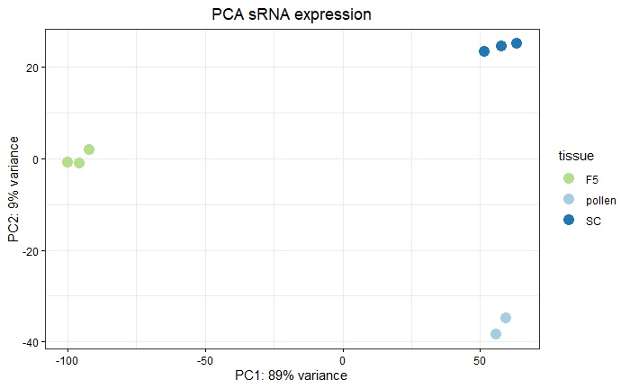

## Reads per million analysis

Normalize raw read count into reads per million to compare samples with each other. Only small RNAs found in at least two biological replicates are considered.

Retrieve sRNAs with found in at least two biological replicates:

```{r}
# Retrieve rows with a maximum of 0 zero 
F5 <-  cts[,1:3]
F5_v <- !(rowSums(F5 == "0")>1)
F5_filtered <-  F5[F5_v,] 
F5 <- rowSums(F5_filtered[,1:3])

# Retrieve rows with a maximum of 1 zero 
SC <- cts[,4:6]
SC_v <- !(rowSums(SC == "0")>1)
SC_filtered <-  SC[SC_v,] 
SC <- rowSums(SC_filtered[,1:3])

# Retrieve rows with a maximum of 1 zero 
pollen <- cts[,7:8]
pollen_v <- !(rowSums(pollen == "0"))
pollen_filtered <-  pollen[pollen_v,] 
pollen <- rowSums(pollen_filtered[,1:2])
```

Do RPM normalization:

```{r}
# RPM normalization
F5_RPM <- F5/(sum(F5)/1000000)
SC_RPM <- SC/(sum(SC)/1000000)
pollen_RPM <- pollen/(sum(pollen)/1000000)

df_F5_RPM <- as.data.frame(F5_RPM)
df_F5_RPM$size <- nchar(rownames(df_F5_RPM))
df_F5_RPM$size <- as.factor(df_F5_RPM$size)
df_F5_RPM <- df_F5_RPM %>% rownames_to_column("sequence")
colnames(df_F5_RPM) <- c("sequence","RPM","size")

df_SC_RPM <- as.data.frame(SC_RPM)
df_SC_RPM$size <- nchar(rownames(df_SC_RPM))
df_SC_RPM$size <- as.factor(df_SC_RPM$size)
df_SC_RPM <- df_SC_RPM %>% rownames_to_column("sequence")
colnames(df_SC_RPM) <- c("sequence","RPM","size")

df_pollen_RPM <- as.data.frame(pollen_RPM)
df_pollen_RPM$size <- nchar(rownames(df_pollen_RPM))
df_pollen_RPM$size <- as.factor(df_pollen_RPM$size)
df_pollen_RPM <- df_pollen_RPM %>% rownames_to_column("sequence")
colnames(df_pollen_RPM) <- c("sequence","RPM","size")

# Check total number of unique sRNA sequences that are present in at least
# two biological replicates
sequence_min_2rep <- unique(c(df_F5_RPM$sequence, df_SC_RPM$sequence, df_pollen_RPM$sequence))
length(sequence_min_2rep)
# [1] 561915

# Save RDS
saveRDS(df_F5_RPM, "data/df_F5_RPM.Rds")
saveRDS(df_SC_RPM, "data/df_SC_RPM.Rds")
saveRDS(df_pollen_RPM, "data/df_pollen_RPM.Rds")

# Load RDS
df_F5_RPM <- readRDS("data/df_F5_RPM.Rds")
df_SC_RPM <- readRDS("data/df_SC_RPM.Rds")
df_pollen_RPM <- readRDS("data/df_pollen_RPM.Rds")


# Group dataframes per size to make plot faster
df_F5_RPM_size <- df_F5_RPM %>% group_by(size) %>% 
  summarize(RPM=sum(RPM), nb_sequence=n(), .groups='drop') %>% 
  arrange(RPM)

df_SC_RPM_size <- df_SC_RPM %>% group_by(size) %>% 
  summarize(RPM=sum(RPM), nb_sequence=n(), .groups='drop') %>% 
  arrange(RPM)

df_pollen_RPM_size <- df_pollen_RPM %>% group_by(size) %>% 
  summarize(RPM=sum(RPM), nb_sequence=n(), .groups='drop') %>% 
  arrange(RPM)

# Create a dataframes containing all 3 together
df_F5_RPM_size$tissue <- "F5"
df_SC_RPM_size$tissue <- "SC"
df_pollen_RPM_size$tissue <- "pollen"

df_F5_SC_pollen_RPM_size <- rbind(df_pollen_RPM_size, df_SC_RPM_size, df_F5_RPM_size)

df_F5_SC_pollen_RPM_size$tissue <- as.factor(df_F5_SC_pollen_RPM_size$tissue)

# order tissue
df_F5_SC_pollen_RPM_size$tissue <- factor(df_F5_SC_pollen_RPM_size$tissue, 
                                          levels=c("pollen","SC","F5"), ordered=T)

saveRDS(df_F5_SC_pollen_RPM_size, "data/df_F5_SC_pollen_RPM_size.Rds")

df_F5_SC_pollen_RPM_size <- readRDS("data/df_F5_SC_pollen_RPM_size.Rds")

```

We have a total of unique sRNA sequences of: 

* F5: 193,967
* SC: 128,639
* Pollen: 328,456
* Across all three tissues: 561,915


## sRNA expression overview

```{r}

ggplot(df_F5_SC_pollen_RPM_size, aes(x=size, y=RPM, group=tissue, color=tissue)) + 
  geom_point() +  
  geom_line() + 
  theme_bw() + 
  ylab("RPM") + 
  xlab("Size in nt") + 
  scale_color_manual(values=c("#a6cee3", "#1f78b4", "#b2df8a"))  + 
  ggtitle("sRNAs expression overview") +  
  theme(axis.text.x = element_text(color="black"),
        axis.text.y = element_text(color="black"),
        axis.ticks = element_line(color = "black")) + 
  theme(plot.title = element_text(hjust = 0.5)) 

```

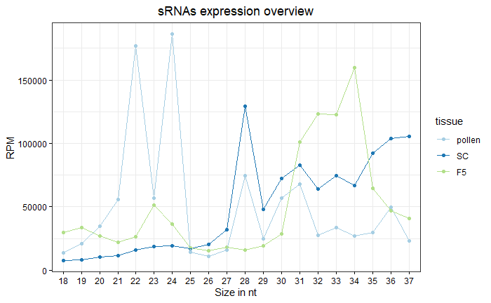


## Intersect F5-SC

```{r}

F5_SC_overlap <- intersect(df_F5_RPM$sequence, df_SC_RPM$sequence)

df_F5_RPM_F5_SC <- df_F5_RPM %>% filter(sequence %in% F5_SC_overlap)
saveRDS(df_F5_RPM_F5_SC, "data/df_F5_RPM_intersect.Rds")

df_SC_RPM_F5_SC <- df_SC_RPM %>% filter(sequence %in% F5_SC_overlap)
saveRDS(df_SC_RPM_F5_SC, "data/df_SC_RPM_intersect.Rds")

```

22,408 sRNAs are found in both SC and F5.


```{r}

df_F5_RPM_F5_SC_size <- df_F5_RPM_F5_SC  %>% group_by(size) %>% 
  summarize(RPM=sum(RPM), nb_sequence=n(), .groups='drop') %>% 
  arrange(RPM)

df_SC_RPM_F5_SC_size <-  df_SC_RPM_F5_SC %>% group_by(size) %>% 
  summarize(RPM=sum(RPM), nb_sequence=n(), .groups='drop') %>% 
  arrange(RPM)
  
# Create a dataframes containing all 3 together
df_F5_RPM_F5_SC_size$tissue <- "F5"
df_SC_RPM_F5_SC_size$tissue <- "SC"

df_F5_SC_RPM_F5_SC_size <- rbind(df_F5_RPM_F5_SC_size, df_SC_RPM_F5_SC_size)

df_F5_SC_RPM_F5_SC_size$tissue <- as.factor(df_F5_SC_RPM_F5_SC_size$tissue)

# order tissue
df_F5_SC_RPM_F5_SC_size$tissue <- factor(df_F5_SC_RPM_F5_SC_size$tissue, 
                                          levels=c("pollen","SC","F5"), ordered=T)

ggplot(df_F5_SC_RPM_F5_SC_size, aes(x=size, y=RPM, group=tissue, color=tissue)) + 
  geom_point() +  
  geom_line() + 
  theme_bw() + 
  ylab("RPM") + 
  xlab("Size in nt") + 
  scale_color_manual(values=c("#1f78b4", "#b2df8a"))  + 
  ggtitle("RPM F5-SC (n=22,408)") +  
  theme(axis.text.x = element_text(color="black"),
        axis.text.y = element_text(color="black"),
        axis.ticks = element_line(color = "black")) + 
  theme(plot.title = element_text(hjust = 0.5)) 

```

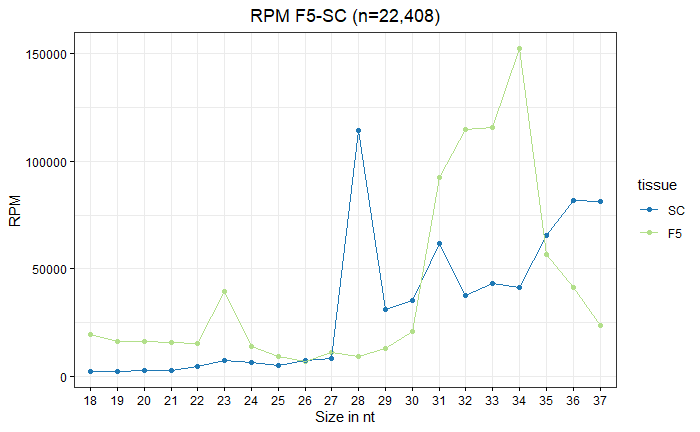

Venn Diagram of the overlap with SC sRNAs:

```{r}
grid.newpage()
draw.pairwise.venn(area1 = 193967, area2 = 128639, cross.area = 22408, category = c("F5","SC"), 
                   lty="blank", fill = c("#b2df8a","#a6cee3"))
```

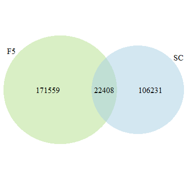

## Permutation overlap F5-pollen

```{r}

perm <- function(sRNA_F5, sRNA_pollen, n) {
  result <- list()
  nb_sRNA_SC <- 128639
  
  for (i in 1:n) {
    pollen_resampled <- sample(sRNA_pollen, size = nb_sRNA_SC)
    intersection <- length(intersect(sRNA_F5, pollen_resampled))
    result[[i]] <- intersection
  }
  return(result)
}

permutation_results <- perm(df_F5_RPM$sequence, df_pollen_RPM$sequence, 1000)

```


```{r}
# Create dataframe to plot the results
df_permutation <- data.frame(matrix(nrow = 1001, ncol = 1))
names(df_permutation) <- c("value")

F5_SC_intersect <- 22408

df_permutation$value <- c(F5_SC_intersect, unlist(permutation_results))

boxplot(df_permutation$value, ylab="Number of intersecting sRNAs", col = "white", 
        main="Intersect permuted 128,639 sRNAs from pollen with F5 sRNAs", 
        outline = F, ylim=c(8000,23000))
stripchart(df_permutation$value,              # Data
           method = "jitter", # Random noise
           pch = 18,          # Pch symbols
           col = "black",           # Color of the symbol
           vertical = TRUE,   # Vertical mode
           add = TRUE)        # Add it over
abline(h = F5_SC_intersect, col="red")

```

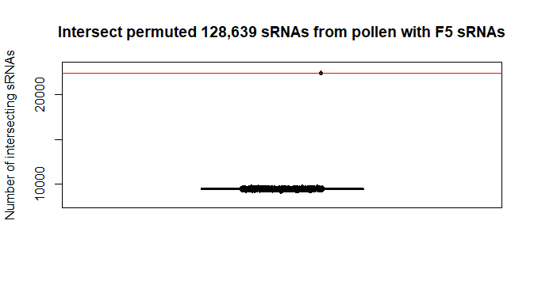
The F5-SC intersect oof 22,408 sRNAs is high above the distribution of the intersect of the 193,967 F5 sRNAs with a permuted distribution of 128,639 pollen sRNAs. The overlap with SC is therefore highly significant.


## sRNAs mapping tRNAs

Use gtrnad database (http://gtrnadb.ucsc.edu/GtRNAdb2/genomes/eukaryota/Zmays7/) and download the High confidence mature tRNA sequences (zeaMay7-mature-tRNAs.fa).

Prepare a fasta file with the 561,915 unique sRNA sequences present in at least 2 replicates across all 3 tissue types.

```{r}
# Extract all sequences from the expression matrix
sequences <- rownames(cts)

# Convert into a fasta file
make_fasta(vector_sequence = sequence_min_2rep, path_output = "data/all_sRNAs_18_37nt.fa")

```


```{bash, eval=FALSE}
# Note that the version is frequently changed so this annotation is not available anymore
# Check the current version for maize on the website or use the Zmays7 provided in data
wget http://gtrnadb.ucsc.edu/GtRNAdb2/genomes/eukaryota/Zmays7/zeaMay7-mature-tRNAs.fa

seqkit stats *fa
file                       format  type  num_seqs  sum_len  min_len  avg_len  max_len
zeaMay7-mature-tRNAs.fa    FASTA   RNA        821   61,056       71     74.4       88

# Convert U to T
sed '/^[^>]/s/U/T/g' zeaMay7-mature-tRNAs.fa > zeaMay7-mature-tRNAs_U_to_T.fa

# Build the bowtie index
bowtie-build -f zeaMay7-mature-tRNAs_U_to_T.fa zeaMay7_mature_tRNAs

# Map all sRNAs without mismatches allowed
bowtie -n 0 -S --threads 16 zeaMay7_mature_tRNAs -f all_sRNAs_18_37nt.fa  | \
    samtools sort | \
    samtools view -bS -F4 -o tRNA_mapped_sRNAs.bam &

# reads processed: 561915
# reads with at least one reported alignment: 5063 (0.90%)
# reads that failed to align: 556852 (99.10%)

# Recover seq names of the mapped sRNAs
samtools view tRNA_mapped_sRNAs.bam | cut -f1 > mapped_sRNA_seq.txt

# Recover from fasta file
seqkit grep -n -f mapped_sRNA_seq.txt all_sRNAs_18_37nt.fa > tRFs_18_37nt.fa

# Retrieve sequence name and tRNA codon
samtools view tRNA_mapped_sRNAs.bam | cut -f1,3 > tRNA_mapped_sRNAs_seq_codon.txt

# Keep only the codon name
while read i; do
gene=$(echo "$i" | cut -f2 | cut -d- -f2,3)
seq_name=$(echo "$i" | cut -f1)
sequence=$(grep -A1 -w ">$seq_name" tRFs_18_37nt.fa | grep -v ">")
echo $sequence $gene
done < tRNA_mapped_sRNAs_seq_codon.txt > tRFs_18_37nt_annotated.txt

# Replace spaces by tabs
cat tRFs_18_37nt_annotated.txt | tr -s " " '\t' > tRFs_18_37nt_annotated.tab.txt

```


```{r}

tRFs_18_37nt_annotate <- read.delim("data/tRFs_18_37nt_annotated.tab.txt", header=FALSE)

colnames(tRFs_18_37nt_annotate) <- c("sequence","tRNA")
tRFs_18_37nt_annotate <- tRFs_18_37nt_annotate %>% mutate_at(1:2, as_factor)

# Merge dataframe
df_F5_RPM_F5_SC_tRF <- merge(df_F5_RPM_F5_SC, tRFs_18_37nt_annotate, by="sequence")

# Export as a text file to put in Excel supp data
write_delim(df_F5_RPM_F5_SC_tRF, "data/df_F5_RPM_F5_SC_tRF.txt", delim="\t")

```

801 observations retrieved from the 5063 sRNAs mapping tRNA genes.

```{r}

df_F5_RPM_F5_SC_tRF_per_type <- df_F5_RPM_F5_SC_tRF %>% group_by(tRNA) %>% 
  summarize(RPM=sum(RPM)) %>% arrange(RPM)

# Reorganize tRNA by decreasing RPM
df_F5_RPM_F5_SC_tRF_per_type$tRNA <- 
  factor(df_F5_RPM_F5_SC_tRF_per_type$tRNA,
  levels=df_F5_RPM_F5_SC_tRF_per_type$tRNA[order(df_F5_RPM_F5_SC_tRF_per_type$RPM, decreasing = TRUE)])

# frequence RPM for each category
# tapply(df_F5_RPM_F5_SC_tRF_per_type$RPM, df_F5_RPM_F5_SC_tRF_per_type$tRNA,
# sum, na.rm = TRUE)/sum(df_F5_RPM_F5_SC_tRF_per_type$RPM)

# Get freq visible in %
# round(sort(tapply(df_F5_RPM_F5_SC_tRF_per_type$RPM, 
# df_F5_RPM_F5_SC_tRF_per_type$tRNA, sum, na.rm = TRUE)/sum(df_F5_RPM_F5_SC_tRF_per_type$RPM), 
# decreasing=T)*100, 2)

# The 6 first codons are above 2%, all are below 0.31%
# round(sort(tapply(df_F5_RPM_F5_SC_tRF_per_type$RPM, 
# df_F5_RPM_F5_SC_tRF_per_type$tRNA, sum, na.rm = TRUE)/1000000, decreasing=T)*100, 2)

# Keep in descending order
top_6_tRNA <- df_F5_RPM_F5_SC_tRF_per_type %>% arrange(desc(RPM)) %>% select(tRNA) %>% head(6)

df_F5_RPM_F5_SC_tRF_top_6 <- df_F5_RPM_F5_SC_tRF %>% filter(tRNA %in% top_6_tRNA$tRNA)

# Order tRNA classes
df_F5_RPM_F5_SC_tRF_top_6$tRNA <- factor(df_F5_RPM_F5_SC_tRF_top_6$tRNA, 
                                         levels=top_6_tRNA$tRNA, ordered=TRUE)


```


## Expression tDR top 6 F5

```{r}
# Restrict to 30-34 and summarize by group to avoid little lines within the plot
df_F5_RPM_F5_SC_tRF_top_6 %>% filter(size %in% c(30:34)) %>%  
  group_by(size,tRNA,  .groups='drop') %>% summarize(RPM=sum(RPM)) %>% 
  ggplot(aes(x=size, y=RPM, fill=tRNA)) + 
  geom_bar(stat="identity") + 
  theme_bw() + ylab("RPM") + 
  xlab("Size") + 
  ggtitle("Top 6 most expression F5-SC tDRs in F5") + 
  scale_fill_manual(values=c("#e41a1c","#377eb8","#4daf4a","#984ea3","#ff7f00","#ffff33")) +
  theme(axis.text.x = element_text(color="black"),axis.text.y = element_text(color="black"),
        axis.ticks = element_line(color = "black")) + 
  theme(plot.title = element_text(hjust = 0.5)) + 
  scale_y_continuous(labels = scales::comma_format())
```


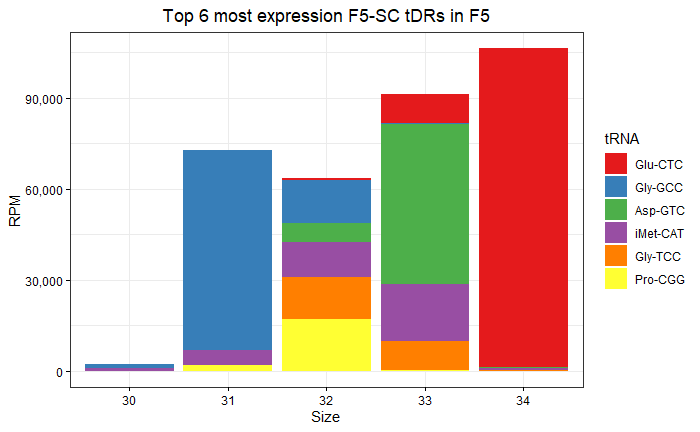


Expression of tDRs in F5, SC, and pollen


## F5 tDRs expression

```{r}
# Merge dataframe
df_F5_RPM_tRF <- merge(df_F5_RPM, tRFs_18_37nt_annotate, by="sequence")

df_F5_RPM_tRF_per_type <- df_F5_RPM_tRF %>% group_by(tRNA) %>% 
  summarize(RPM=sum(RPM)) %>% arrange(RPM)

# Reorganize tRNA by decreasing RPM_sum
df_F5_RPM_tRF_per_type$tRNA <- 
  factor(df_F5_RPM_tRF_per_type$tRNA, levels=df_F5_RPM_tRF_per_type$tRNA[order(df_F5_RPM_tRF_per_type$RPM, decreasing = TRUE)])

df_F5_RPM_tRF_per_type %>% arrange(desc(RPM)) %>% head(10) %>% 
  ggplot(aes(x=tRNA, y=RPM, fill=tRNA)) +
  geom_bar(stat="identity", fill="grey") + 
  theme_bw() + 
  ylab("RPM") + 
  xlab("tRNA gene mapped") + 
  ggtitle("RPM F5 mapping tRNA, F5 expression") + 
  theme(axis.text.x = element_text(color="black"),
        axis.text.y = element_text(color="black"),
        axis.ticks = element_line(color = "black")) + 
  theme(plot.title = element_text(hjust = 0.5)) + 
  scale_y_continuous(labels = scales::comma_format())

```

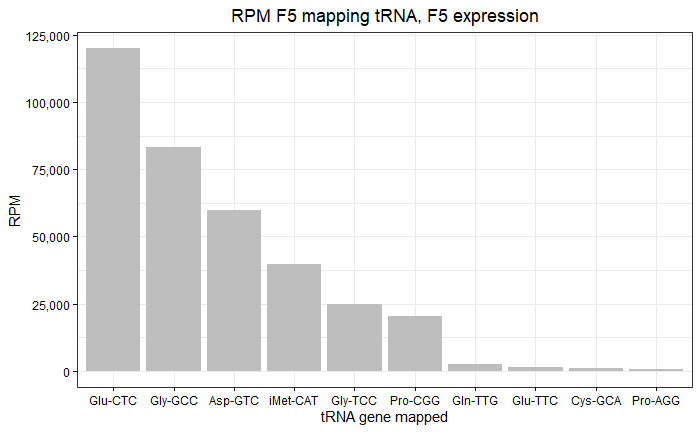

## SC tDRs expression

```{r}
# Merge dataframe
df_SC_RPM_tRF <- merge(df_SC_RPM, tRFs_18_37nt_annotate, by="sequence")

df_SC_RPM_tRF_per_type <- df_SC_RPM_tRF %>% group_by(tRNA) %>% 
  summarize(RPM=sum(RPM)) %>% arrange(RPM)

# Reorganize tRNA by decreasing RPM_sum
df_SC_RPM_tRF_per_type$tRNA <- 
  factor(df_SC_RPM_tRF_per_type$tRNA, 
  levels=df_SC_RPM_tRF_per_type$tRNA[order(df_SC_RPM_tRF_per_type$RPM, decreasing = TRUE)])

df_SC_RPM_tRF_per_type %>% arrange(desc(RPM)) %>% head(10) %>% 
  ggplot(aes(x=tRNA, y=RPM, fill=tRNA)) +
  geom_bar(stat="identity", fill="grey") + 
  theme_bw() + 
  ylab("RPM") + 
  xlab("tRNA gene mapped") + 
  ggtitle("RPM SC mapping tRNA, SC expression") + 
  theme(axis.text.x = element_text(color="black"),
        axis.text.y = element_text(color="black"),
        axis.ticks = element_line(color = "black")) + 
  theme(plot.title = element_text(hjust = 0.5)) + 
  scale_y_continuous(labels = scales::comma_format())

```

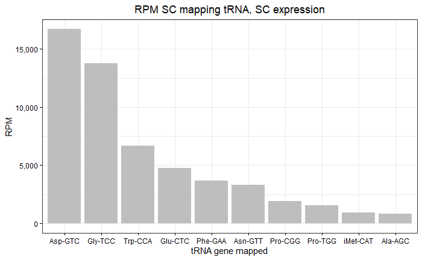

## Pollen tDRs expression

```{r}
# Merge dataframe
df_pollen_RPM_tRF <- merge(df_pollen_RPM, tRFs_18_37nt_annotate, by="sequence")

df_pollen_RPM_tRF_per_type <- df_pollen_RPM_tRF %>% group_by(tRNA) %>% 
  summarize(RPM=sum(RPM)) %>% arrange(RPM)

# Reorganize tRNA by decreasing RPM_sum
df_pollen_RPM_tRF_per_type$tRNA <- factor(df_pollen_RPM_tRF_per_type$tRNA,
 levels=df_pollen_RPM_tRF_per_type$tRNA[order(df_pollen_RPM_tRF_per_type$RPM, decreasing = TRUE)])

df_pollen_RPM_tRF_per_type %>% arrange(desc(RPM)) %>% head(10) %>% ggplot(aes(x=tRNA, y=RPM, fill=tRNA)) +
  geom_bar(stat="identity", fill="grey") + 
  theme_bw() + 
  ylab("RPM") + 
  xlab("tRNA gene mapped") + 
  ggtitle("RPM pollen mapping tRNA, pollen expression") + 
  theme(axis.text.x = element_text(color="black"),
        axis.text.y = element_text(color="black"),
        axis.ticks = element_line(color = "black")) + 
  theme(plot.title = element_text(hjust = 0.5)) + 
  scale_y_continuous(labels = scales::comma_format())

```

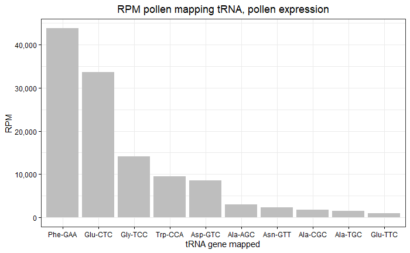


## UNITAS analysis

Install UNITAS v1.8.0

```{bash, eval=FALSE}
# Installation
wget --no-check-certificate https://www.smallrnagroup.uni-mainz.de/software/unitas_1.8.0.pl

chmod 755 unitas_1.8.0.pl

cpan
install Archive::Extract
exit

# LWP::Protocol::https already installed 
perldoc -l LWP::Protocol::https

# Get maize database
perl unitas_1.8.0.pl  -refdump -species Zea_mays

```

Get the TE annotation from B73 NAM5:

```{bash, eval=FALSE}
# Integrate TE annotation in UNITAS output

# Download B73 NAM5 TE annotation
wget https://raw.githubusercontent.com/oushujun/MTEC/master/maizeTE02052020

# I just need to add the prefix "TE|" so that Unitas 
# classifies the mapped sRNAs in the TE category
seqkit replace -p ^ -r "TE|" maizeTE02052020.fa > maizeTE02052020_renamed.fa

```

Add TE annotation using the `-refseq` argument. Unitas requires a fasta file with header having the type first, followed by pipe sign.

```{bash, eval=FALSE}
# Rename headers of input fasta file with a running number to avoid issue with UNITAS
seqkit replace -p .+ -r "seq_{nr}" all_sRNAs_18_37nt.fa > all_sRNAs_18_37nt.renamed.fa

perl unitas_1.8.0.pl -input all_sRNAs_18_37nt.renamed.fa \
    -refseq maizeTE02052020_renamed.fa -species Zea_mays

# UNITAS creates a folder with the HTML reports and all output files of the analysis

```


At the time of the analysis, here are the different versions of the databases we had:

```
SeqMap version/date: ...................... 1.0.13
Genomic tRNA database version/date: ....... 24.01.2019 (dd.mm.yyyy)
piRNA cluster database version/date: ...... 20.10.2023 (dd.mm.yyyy)
Ensembl version/date: ..................... Release 96
EnsemblGenomes version/date: .............. Release 43
tRF-1 sequence data version/date: ......... 09.04.2019 (dd.mm.yyyy)
tRNA-leader sequence data version/date: ... 09.04.2019 (dd.mm.yyyy)
SILVA rRNA (SSU) database version/date: ... Release 132
miRBase database version/date: ........ Release 22
SeqMap version/date: ...................... 1.0.13
```

## sRNA expression by category

Use the annotation derived from the mapping on the gtrnadb tRNA database and UNITAS to display the type of sRNA expressed.

```{r}

# Download fasta sequences annotated as rRNA by UNITAS
df_rRFs <- fasta_to_df("data/unitas/fasta/unitas.rRNA.fas")

df_F5_RPM_F5_SC_tRF_rRF <- df_F5_RPM_F5_SC %>% 
  mutate(category=ifelse((sequence %in% tRFs_18_37nt_annotate$s), 
                         "tRNA", ifelse((sequence %in% df_rRFs$s), "rRNA","others")))

df_F5_RPM_F5_SC_tRF_rRF$category <- as.factor(df_F5_RPM_F5_SC_tRF_rRF$category)

df_F5_RPM_F5_SC_tRF_rRF_size <- df_F5_RPM_F5_SC_tRF_rRF %>% 
  group_by(size, category) %>% 
  summarize(RPM=sum(RPM), nb_sequence=n(), .groups='drop') %>% 
  arrange(RPM)

# Move categories around
# Change order of the samples for plotting
df_F5_RPM_F5_SC_tRF_rRF_size$category <- factor(df_F5_RPM_F5_SC_tRF_rRF_size$category, 
                                                levels = c("rRNA", "tRNA","others"))


ggplot(df_F5_RPM_F5_SC_tRF_rRF_size, aes(x=size, y=RPM, fill=category)) + 
  geom_bar(stat="identity") + 
  theme_bw() + ylab("RPM") + 
  xlab("Size") + 
  ggtitle("F5-SC sRNAs expression in F5 (n=22,408)") + 
  scale_fill_manual(values=c("#d8b365", "#998ec3","#5ab4ac")) + 
  theme(plot.title = element_text(hjust = 0.5))  +
  theme(axis.text.x = element_text(color="black"),
        axis.text.y = element_text(color="black"),
        axis.ticks = element_line(color = "black"))+ 
  scale_y_continuous(labels = scales::comma_format()) 

```


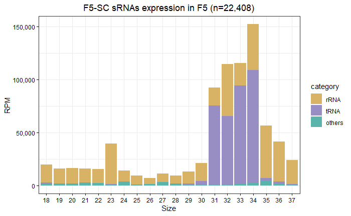


## Analysis TEs

### Mapping

Use the maizeTE02052020 fasta file used in UNITAS.

```{bash, eval=FALSE}

module load fastx bowtie samtools

# Download B73 NAM5 TE annotation
wget https://raw.githubusercontent.com/oushujun/MTEC/master/maizeTE02052020

# I just need to add the prefix "TE|" so that Unitas 
# classifies the mapped sRNAs in the TE category
seqkit replace -p ^ -r "TE|" maizeTE02052020.fa > maizeTE02052020_renamed.fa

# Create bowtie indexes
bowtie-build -f maizeTE02052020_renamed.fa maizeTE02052020

srun --time=00:05:00 -c 16 --mem=20Gb bowtie -S -n 0 -l 37 maizeTE02052020 \
--threads 16 -f all_sRNAs_18_37nt.fa | samtools sort | \
samtools view -F4 -b -o all_sRNAs_18_37nt_TEs.bam -

# reads processed: 561915
# reads with at least one reported alignment: 76739 (13.66%)
# reads that failed to align: 485176 (86.34%)

# Make a fasta file
samtools view -b all_sRNAs_18_37nt_TEs.bam | samtools bam2fq | fastq_to_fasta -i - -o all_sRNAs_18_37nt_TEs.fa

# Create a dictionary (seq name and TE name
samtools view all_sRNAs_18_37nt_TEs.bam | cut -f1,3 > seq_2_TE.txt
cut -d'#' -f2 seq_2_TE.txt > family
paste seq_2_TE.txt family > seq_2_TE_family.txt

```


```{r}

# Import fasta
df_TEs <- fasta_to_df("data/all_sRNAs_18_37nt_TEs.fa")

# Import database
seq_2_TE_family <- read.delim("data/seq_2_TE_family.txt", header=FALSE)

colnames(seq_2_TE_family) <- c("id","TE","TE_family")

df_TEs_annotated <- merge.data.frame(df_TEs, seq_2_TE_family, by="id")

```


```{r}
# F5-SC intersect in F5
df_F5_RPM_F5_SC <- readRDS("data/df_F5_RPM_intersect.Rds")

df_F5_RPM_F5_SC_TE <- merge.data.frame(df_TEs_annotated, df_F5_RPM_F5_SC, by="sequence")
# 594

# F5
df_F5_RPM <- readRDS("data/df_F5_RPM.Rds")

df_F5_RPM_TE <- merge.data.frame(df_TEs_annotated, df_F5_RPM, by="sequence")

# SC
df_SC_RPM <- readRDS("data/df_SC_RPM.Rds")

df_SC_RPM_TE <- merge.data.frame(df_TEs_annotated, df_SC_RPM, by="sequence")
# 5130

# Pollen
df_pollen_RPM <- readRDS("data/df_pollen_RPM.Rds")

df_pollen_RPM_TE <- merge.data.frame(df_TEs_annotated, df_pollen_RPM, by="sequence")
# 63851

```


### Relative expression per sRNA size

```{r}

df_pollen_RPM_TE_size <- df_pollen_RPM_TE %>% group_by(size) %>% 
  summarize(RPM=sum(RPM), nb_sequence=n(), .groups='drop') %>% 
  arrange(RPM)

df_pollen_RPM_TE_size$percent <- df_pollen_RPM_TE_size$RPM/sum(df_pollen_RPM_TE_size$RPM)

df_SC_RPM_TE_size <- df_SC_RPM_TE %>% group_by(size) %>% 
  summarize(RPM=sum(RPM), nb_sequence=n(), .groups='drop') %>% 
  arrange(RPM)

df_SC_RPM_TE_size$percent <- df_SC_RPM_TE_size$RPM/sum(df_SC_RPM_TE_size$RPM)

df_F5_RPM_TE_size <- df_F5_RPM_TE %>% group_by(size) %>% 
  summarize(RPM=sum(RPM), nb_sequence=n(), .groups='drop') %>% arrange(RPM)

df_F5_RPM_TE_size$percent <- df_F5_RPM_TE_size$RPM/sum(df_F5_RPM_TE_size$RPM)

df_F5_RPM_F5_SC_TE_size <- df_F5_RPM_F5_SC_TE  %>% 
  group_by(size) %>% 
  summarize(RPM=sum(RPM), nb_sequence=n(), .groups='drop') %>% arrange(RPM)

df_F5_RPM_F5_SC_TE_size$percent <- df_F5_RPM_F5_SC_TE_size$RPM/sum(df_F5_RPM_F5_SC_TE_size$RPM)


df_pollen_RPM_TE_size$compartment <- "pollen"
df_SC_RPM_TE_size$compartment <- "SC"
df_F5_RPM_TE_size$compartment <- "F5"
df_F5_RPM_F5_SC_TE_size$compartment <- "F5-SC"

df_all_RPM_TE_size <- rbind(df_pollen_RPM_TE_size, 
                            df_SC_RPM_TE_size, df_F5_RPM_TE_size, df_F5_RPM_F5_SC_TE_size)

df_all_RPM_TE_size$compartment <- factor(df_all_RPM_TE_size$compartment, 
                                         levels = c("pollen","SC","F5","F5-SC"))


ggplot(df_all_RPM_TE_size, aes(x=size, y=percent, fill=compartment)) + 
  geom_bar(stat="identity", position="dodge2") + theme_bw() + 
  ylab("Percent RPM per size") + 
  xlab("Size") + 
  ggtitle("Relative expression of TE-mapped sRNAs per size") + 
  scale_y_continuous(labels=scales::percent) + 
  scale_fill_manual(values=c("#a6cee3", "#1f78b4", "#b2df8a","#33a02c")) + 
  theme(axis.text.x = element_text(color="black"),
        axis.text.y = element_text(color="black"),
        axis.ticks = element_line(color = "black")) + 
  theme(plot.title = element_text(hjust = 0.5)) 

```

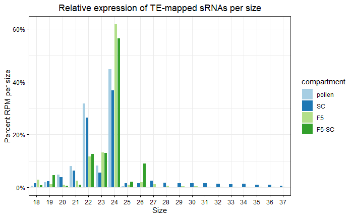

### Relative expression per TE family

```{r}

# F5-SC intersect
df_F5_RPM_F5_SC_TE_per_family <- df_F5_RPM_F5_SC_TE %>% group_by(TE_family) %>% 
  summarize(RPM=sum(RPM), nb_sequence=n(), .groups='drop') 

factor_TE_family <- df_F5_RPM_F5_SC_TE_per_family$TE_family

df_F5_RPM_F5_SC_TE_per_family$TE_family <- factor(factor_TE_family, 
  levels = factor_TE_family[order(df_F5_RPM_F5_SC_TE_per_family$RPM, decreasing = TRUE)])


# F5
df_F5_RPM_TE_per_family <- df_F5_RPM_TE %>% group_by(TE_family) %>% 
  summarize(RPM=sum(RPM), nb_sequence=n(), .groups='drop') 

factor_TE_family <- df_F5_RPM_TE_per_family$TE_family

df_F5_RPM_TE_per_family$TE_family <- factor(factor_TE_family, 
levels = factor_TE_family[order(df_F5_RPM_TE_per_family$RPM, decreasing = TRUE)])

# SC
df_SC_RPM_TE_per_family <- df_SC_RPM_TE %>% group_by(TE_family) %>% 
  summarize(RPM=sum(RPM), nb_sequence=n(), .groups='drop') 

factor_TE_family <- df_SC_RPM_TE_per_family$TE_family

df_SC_RPM_TE_per_family$TE_family <- factor(factor_TE_family, 
levels = factor_TE_family[order(df_SC_RPM_TE_per_family$RPM, decreasing = TRUE)])

# Pollen
df_pollen_RPM_TE_per_family <- df_pollen_RPM_TE %>% group_by(TE_family) %>% 
  summarize(RPM=sum(RPM), nb_sequence=n(), .groups='drop') 

factor_TE_family <- df_pollen_RPM_TE_per_family$TE_family

df_pollen_RPM_TE_per_family$TE_family <- factor(factor_TE_family, 
levels = factor_TE_family[order(factor_TE_family, decreasing = TRUE)])

# Add compartment name
df_F5_RPM_F5_SC_TE_per_family$compartment <- "F5-SC"
df_F5_RPM_TE_per_family$compartment <- "F5"
df_SC_RPM_TE_per_family$compartment <- "SC"
df_pollen_RPM_TE_per_family$compartment <- "pollen"

# Calulate percentage of RPM for each compartment
df_F5_RPM_F5_SC_TE_per_family$percent <- df_F5_RPM_F5_SC_TE_per_family$RPM/sum(df_F5_RPM_F5_SC_TE_per_family$RPM)

df_F5_RPM_TE_per_family$percent <- df_F5_RPM_TE_per_family$RPM/sum(df_F5_RPM_TE_per_family$RPM)

df_SC_RPM_TE_per_family$percent <- df_SC_RPM_TE_per_family$RPM/sum(df_SC_RPM_TE_per_family$RPM)

df_pollen_RPM_TE_per_family$percent <- 
  df_pollen_RPM_TE_per_family$RPM/sum(df_pollen_RPM_TE_per_family$RPM)

# Merge into one dataframe
df_all_RPM_TE_per_family <- rbind(df_F5_RPM_F5_SC_TE_per_family, 
                                  df_F5_RPM_TE_per_family, df_SC_RPM_TE_per_family, 
                                  df_pollen_RPM_TE_per_family)

df_all_RPM_TE_per_family$compartment <- factor(df_all_RPM_TE_per_family$compartment, 
                                               levels = c("pollen","SC","F5","F5-SC"))

ggplot(df_all_RPM_TE_per_family, aes(x=TE_family, y=percent, fill=compartment)) + 
  geom_bar(stat="identity", position="dodge") + 
  theme_bw() + 
  ylab("Percent RPM per compartment") + 
  xlab("TE family") +  
  ggtitle("Relative expression of TE-mapped sRNAs per TE family") + 
  theme(axis.text.x = element_text(angle=90, hjust=1)) +  
  theme(axis.text.x = element_text(color="black"),
        axis.text.y = element_text(color="black"),
        axis.ticks = element_line(color = "black")) + 
  theme(plot.title = element_text(hjust = 0.5)) + 
  scale_y_continuous(labels=scales::percent) +  
  scale_fill_manual(values=c("#a6cee3", "#1f78b4", "#b2df8a","#33a02c"))

```

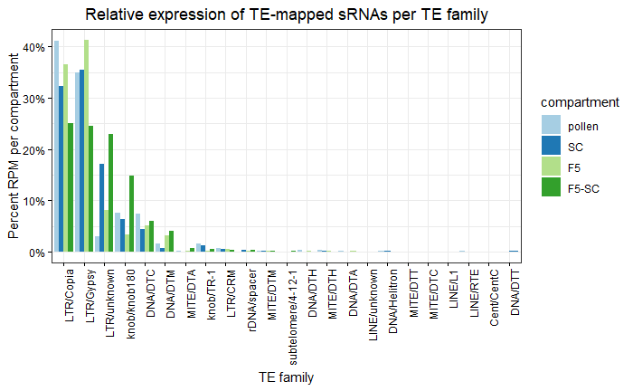

## miRNA expression analysis


```{bash, eval=FALSE}

cd data/unitas/

cut -f1,2 unitas.miR-table_Zea_mays.txt > unitas.miR-table_Zea_mays.id_seq.txt

cut -f1 unitas.miR-table_Zea_mays.id_seq.txt | cut -d- -f1 | \
sed 's/[a-z]$//g' > unitas.miR-table_Zea_mays.id_seq_family.txt

paste unitas.miR-table_Zea_mays.id_seq.txt unitas.miR-table_Zea_mays.id_seq_family.txt > \
unitas.miR-table_Zea_mays.id_seq_family.all.txt

```

```{r}

df_unitas_miRNA_annotation <- read.delim("data/unitas/unitas.miR-table_Zea_mays.id_seq_family.all.txt")

colnames(df_unitas_miRNA_annotation) <- c("miRNA","sequence","family")
df_unitas_miRNA_annotation$family <- as.factor(df_unitas_miRNA_annotation$family)

# Remove all miRNAs with SNPs
df_unitas_miRNA_annotation <- df_unitas_miRNA_annotation %>% filter(!grepl("\\(", miRNA))

df_SC_RPM_miRNA <- merge.data.frame(df_SC_RPM, df_unitas_miRNA_annotation, by="sequence")
df_pollen_RPM_miRNA <- merge.data.frame(df_pollen_RPM, df_unitas_miRNA_annotation, by="sequence")
df_F5_RPM_miRNA <- merge.data.frame(df_F5_RPM, df_unitas_miRNA_annotation, by="sequence")
df_F5_RPM_F5_SC_RPM_miRNA <- merge.data.frame(df_F5_RPM_F5_SC, df_unitas_miRNA_annotation, by="sequence")

list_miRNA_df <- list(pollen=df_pollen_RPM_miRNA, SC=df_SC_RPM_miRNA, 
                      F5=df_F5_RPM_miRNA, F5_SC=df_F5_RPM_F5_SC_RPM_miRNA)

# Export df_F5_RPM_F5_SC_RPM_miRNA
#write_delim(df_F5_RPM_F5_SC_RPM_miRNA, "data/df_F5_RPM_F5_SC_RPM_miRNA.txt")


```


### Expression of F5-SC sRNAs across tissues

```{r}
summary_df <- function(df, name){
  df_family <- df %>% group_by(family) %>% summarize(RPM=sum(RPM))
  df_family$compartment <- name
  return(df_family)
}

df_pollen_RPM_miRNA_family <- summary_df(list_miRNA_df[[1]],"pollen")
df_SC_RPM_miRNA_family <- summary_df(list_miRNA_df[[2]],"SC")
df_F5_RPM_miRNA_family <- summary_df(list_miRNA_df[[3]],"F5")
df_F5_RPM_F5_SC_RPM_miRNA_family <- summary_df(list_miRNA_df[[4]],"F5_SC")


df_all_miRNA <- rbind(df_pollen_RPM_miRNA_family, df_SC_RPM_miRNA_family, 
                      df_F5_RPM_miRNA_family, df_F5_RPM_F5_SC_RPM_miRNA_family)

df_all_miRNA$compartment <- as.factor(df_all_miRNA$compartment)


summary_df_seq <- function(df, name){
  df$compartment <- name
  return(df)
}

df_pollen_RPM_miRNA_seq <- summary_df_seq(list_miRNA_df[[1]],"pollen")
df_SC_RPM_miRNA_seq <- summary_df_seq(list_miRNA_df[[2]],"SC")
df_F5_RPM_miRNA_seq <- summary_df_seq(list_miRNA_df[[3]],"F5")
df_F5_RPM_F5_SC_RPM_miRNA_seq <- summary_df_seq(list_miRNA_df[[4]],"F5_SC")

df_all_miRNA_seq <- rbind(df_pollen_RPM_miRNA_seq, df_SC_RPM_miRNA_seq, df_F5_RPM_miRNA_seq)

# Order compartments
df_all_miRNA$compartment <- factor(df_all_miRNA$compartment, levels = c("pollen", "SC", "F5", "F5_SC"))

# Sort by alphnumerical orders the miRNAs
sorted_family <- gtools::mixedsort(as.character(unique(df_all_miRNA$family)))

df_all_miRNA$family <- factor(df_all_miRNA$family, levels =sorted_family)

# Plot
ggplot(df_all_miRNA, aes(x=family, y=RPM, fill=compartment)) + 
  geom_bar(stat="identity", position="dodge2")+ 
  theme_bw()  + 
  ggtitle("F5-SC miRNA expression") + 
  theme(axis.text.x = element_text(color="black"),
        axis.text.y = element_text(color="black"),
        axis.ticks = element_line(color = "black")) + 
  theme(plot.title = element_text(hjust = 0.5)) + 
  scale_y_continuous(labels = scales::comma_format()) +  
  theme(axis.text.x = element_text(angle=90, hjust=1)) +  
  scale_fill_manual(values=c("#a6cee3", "#1f78b4", "#b2df8a","#33a02c"))

```

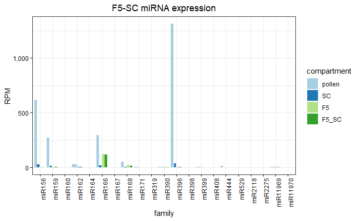


### Subset miRNAs in F5-SC

```{r}

# Get all F5_SC miRNA sequences
df_F5_SC_miRNA_seq <- df_all_miRNA_seq %>% filter(sequence %in% df_F5_RPM_F5_SC_RPM_miRNA$sequence)

# Summarize by family
df_F5_SC_RPM_miRNA_family <- df_F5_SC_miRNA_seq %>% 
  group_by(family, compartment) %>% summarize(RPM=sum(RPM))

# Discard miR2118 because it is a prediction with mismatch
df_F5_SC_RPM_miRNA_family <-df_F5_SC_RPM_miRNA_family %>% filter(family!="miR2118")

# Sort miRNA
df_F5_SC_RPM_miRNA_family$family <- factor(df_F5_SC_RPM_miRNA_family$family, 
        levels =c("miR156", "miR159", "miR166", "miR168", "miR396","miR444"))

df_F5_SC_RPM_miRNA_family$compartment <- factor(df_F5_SC_RPM_miRNA_family$compartment, 
                                                levels =c("pollen", "SC", "F5"))

ggplot(df_F5_SC_RPM_miRNA_family, aes(x=family, y=RPM, fill=compartment)) + 
  geom_bar(stat="identity", position="dodge2")+
  ggtitle("F5-SC miRNA expression") +
  theme_bw()  + 
  theme(axis.text.x = element_text(color="black"),
        axis.text.y = element_text(color="black"),
        axis.ticks = element_line(color = "black")) + 
  theme(plot.title = element_text(hjust = 0.5)) + 
  scale_y_continuous(labels = scales::comma_format()) +  
  scale_fill_manual(values=c("#a6cee3", "#1f78b4", "#b2df8a"))

```


```{r}

plot_per_family <- function(df, title){
  df_family <- df %>% group_by(family) %>% summarize(RPM=sum(RPM))
  df_family$family <- factor(df_family$family, 
                             levels=df_family$family[order(df_family$RPM, decreasing = TRUE)])
  g1 <- df_family %>% arrange(desc(RPM)) %>% 
    ggplot(aes(x=family, y=RPM)) + 
    geom_bar(stat="identity") + 
    theme_bw() + ylab("RPM") + 
    xlab("miRNA family mapped") + 
    ggtitle(title) +  
    theme(axis.text.x = element_text(color="black"),
          axis.text.y = element_text(color="black"),
          axis.ticks = element_line(color = "black")) + 
    theme(plot.title = element_text(hjust = 0.5)) + 
    scale_y_continuous(labels = scales::comma_format()) + 
    theme(axis.text.x = element_text(angle=90, hjust=1))
  return(g1)
}

g1 <- plot_per_family(list_miRNA_df[[1]],"miRNA RPM pollen (n=121)")
g2 <- plot_per_family(list_miRNA_df[[2]],"miRNA RPM SC (n=42)")
g3 <- plot_per_family(list_miRNA_df[[3]],"miRNA RPM F5 (n=65)")
g4 <- plot_per_family(list_miRNA_df[[4]],"miRNA RPM F5-SC (n=20)")

ggarrange(g1,g2,g3,g4, nrow=2, ncol=2)

```

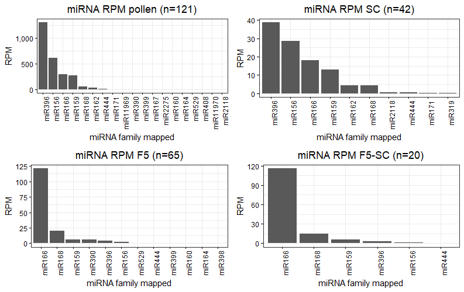


# Degradome analysis

The degradome library for B73 mature pollen sample was made as described in [Li et al., 2019](https://doi.org/10.1186/s13007-019-0524-7).

## Pipeline for library preparation

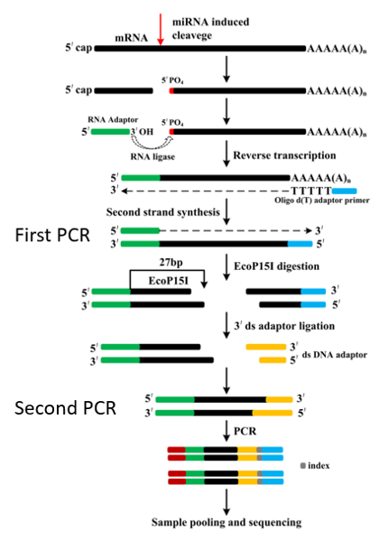

Image modified from [Li et al., 2019](https://doi.org/10.1186/s13007-019-0524-7).


## Degradome library structure

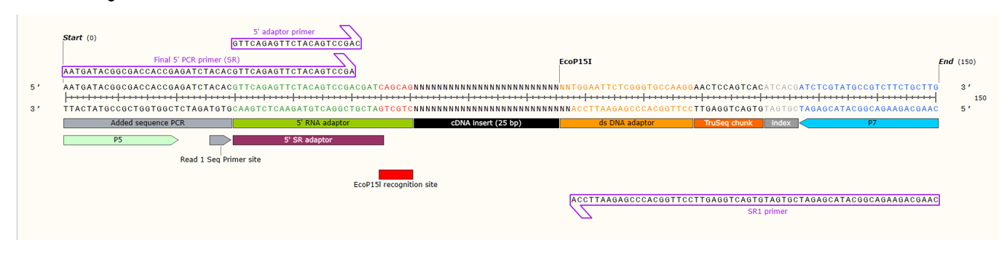

*Degradome library structure*

Image made with the SnapGene software (www.snapgene.com).

## Trimming

Remove the 5' sequence matching the EcoP15I recognition site, then the 3' sequencing containing the 3' adaptor sequence, then remove all trimmed sequences that are not 27-nt in length.

```{bash, eval=FALSE}
# Trimming
cutadapt -j 0 -g AGCAG --discard-untrimmed SRR28009042.fastq | \
cutadapt -j 0 -a AGATCGGAAGAGCACAC --discard-untrimmed - | \
cutadapt -j 0 -m 27 -M 27 -o SRR28009042.trimmed.fq -

# Turn into fasta
cutadapt -j 0 -o SRR28009042.fasta SRR28009042.trimmed.fq.gz &

```

30.68M reads retained after trimming.


## Cleaveland analysis

Clone Cleaveland repository from https://github.com/MikeAxtell/CleaveLand4 and install dependencies (see Clevaland documentation).

List of the 20 miRNAs found in F5-SC intersect:

```{r}
# Create a fasta file with this list of 20 sequences
# Remove space in miRNA vector
df_F5_RPM_F5_SC_RPM_miRNA$miRNA <- gsub(" ","",df_F5_RPM_F5_SC_RPM_miRNA$miRNA)

# Create unique IDs
unique_ID <- paste(df_F5_RPM_F5_SC_RPM_miRNA$miRNA, seq(1:20),sep="_")

# Create a fasta file with all miRNA sequences
make_fasta(vector_sequence = df_F5_RPM_F5_SC_RPM_miRNA$sequence, 
           path_output = "data/df_F5_RPM_F5_SC_RPM_miRNA.fa", sequence_names = unique_ID)

```


```{bash, eval=FALSE}

# Get cDNA sequences from B73 NAM5
wget https://download.maizegdb.org/Zm-B73-REFERENCE-NAM-5.0/Zm-B73-REFERENCE-NAM-5.0_Zm00001eb.1.cdna.fa.gz
gunzip Zm-B73-REFERENCE-NAM-5.0_Zm00001eb.1.cdna.fa.gz

# Run cleaveland
CleaveLand4.pl -e SRR28009042.fasta -u df_F5_RPM_F5_SC_RPM_miRNA.fa \
  -n Zm-B73-REFERENCE-NAM-5.0_Zm00001eb.1.cdna.fa \
  -o output_cleaveland_dir -t > df_F5_RPM_F5_SC_RPM_miRNA_results.txt

```


```{r}

# Get significant hits
df_cleaveland_raw <- read.delim("data/df_F5_RPM_F5_SC_RPM_miRNA_results.txt", 
                                header=TRUE, skip = 8)

# Retrieve query sRNAs and target region from column "Sequence"
df_cleaveland <- df_cleaveland_raw %>% 
  separate(Sequence, c("target_seq", "query_seq"),sep = "&", remove=F)

# Change Us to Ts
df_cleaveland$target_seq <- gsub("U", "T", df_cleaveland$target_seq)
df_cleaveland$query_seq <- gsub("U", "T", df_cleaveland$query_seq)

# Remove hyphens from sequences (prevent querying afterwards)
df_cleaveland$target_seq <- gsub("-", "", df_cleaveland$target_seq)
df_cleaveland$query_seq <- gsub("-", "", df_cleaveland$query_seq)

# Get unique geneID
df_cleaveland <- df_cleaveland %>% 
  separate(Transcript, c("geneID", "Tnum"),sep = "_", remove = F)

saveRDS(df_cleaveland, "data/df_F5_RPM_F5_SC_RPM_miRNA_results.Rds")

write_delim(df_cleaveland, "data/df_F5_RPM_F5_SC_RPM_miRNA_results_all.txt", delim="\t")

df_cleaveland_cleaned <- df_cleaveland %>% filter(DegradomePval < 0.05) %>%
  filter(DegradomeCategory %in% c("0","1","2"))

# Save as R object
write_delim(df_cleaveland_cleaned, "data/df_F5_RPM_F5_SC_RPM_miRNA_results_sig.txt", delim="\t")

# Get list of genes
cut -f1 df_F5_RPM_F5_SC_RPM_miRNA_results_sig.txt | \
cut -d_ -f1 | sort | uniq | grep "Zm"
Zm00001eb000690
Zm00001eb031670
Zm00001eb050660
Zm00001eb057260
Zm00001eb136060
Zm00001eb169410
Zm00001eb192810
Zm00001eb213430
Zm00001eb223610
Zm00001eb322280
Zm00001eb404260
```

11 genes found as target for the sRNAs annotated as 20 miRNAs from the F5-SC intersect.

Zm00001eb000690
Zm00001eb031670
Zm00001eb050660
Zm00001eb057260
Zm00001eb136060
Zm00001eb169410
Zm00001eb192810
Zm00001eb213430
Zm00001eb223610
Zm00001eb322280
Zm00001eb404260


# Sperm cell DNA methylation analysis

There are 3 replicates for sperm cell tissue (70SC, 84SC, 87SC). The prefix number indicates the number of sperm cells isolated by Stefan. The libraries were made according to a single-cell post-bisulfite adapter treatment scBS-seq ([Smallwood et al., 2014](https://www.nature.com/articles/nmeth.3035)). Sequencing in PE 100+100 mode. The first 9 bp 5' of the reads should be clipped. The 3' end contains Illumina Universal Adapter (AGATCGGAAGAG based on https://github.com/golharam/FastQC/blob/master/Configuration/adapter_list.txt).

The method is based on post-bisulfite adaptor tagging. This method generates many chimeric read pairs so that it is advised to map the read1 and 2 separately (as if single end) (https://sequencing.qcfail.com/articles/pbat-libraries-may-generate-chimaeric-read-pairs/). See also [Wu et al 2019](https://pubmed.ncbi.nlm.nih.gov/30859188/).

Read processing as described in Smallwood 2014:

> Sequencing data processing and data analysis. Raw sequence reads were trimmed to remove the first 9 base pairs, adaptor contamination and poor-quality reads using Trim Galore! (v0.3.5, http:// www.bioinformatics.babraham.ac.uk/projects/trim_galore /, parameters:–clip_r1 9–clip_r2 9 –paired). Owing to the multiple rounds of random priming performed with oligo 1, scBS-seq libraries are nondirectional. Trimmed sequences were first mapped to the human genome (build GRCh37) using Bismark21 (v0.10.1; parameters:–pe,–bowtie2,–non_directional,–unmapped), resulting in 1.4% mapping efficiency (0.2–13.2% range). Remaining sequences were mapped to the mouse genome (build NCBI37) in single-end mode (Bismark parameters:–bowtie2non_directional). Methylation calls were extracted after duplicate sequences had been excluded. For oocyte bulk analysis, our MII bulk data set was merged in silico with previously published data sets8 (DNA Data Bank of Japan, GenBank and European Molecular Biology Laboratory accession number DRA000570). Data visualization and analysis were performed using SeqMonk, custom R and Java scripts. For Figure 1c, C+G methylation was calculated as the average of methylation for each CpG position, and non-CpG methylation was extracted from the Bismark reports. Trend line in Figure 1b was calculated using polynomial regression. Percentage of concordance was calculated as the percentage of CpGs presenting the same methylation call at the same genomic position across two cells. For correlation analysis (Pearson’s), 2-kb windows were defined informative if at least 8 CpGs per window were sequenced. CGI annotation used is from CXXC affinity purification plus deep sequencing (CAP-seq) experiments22. Informative CGIs were defined if at least 10 CpGs per CGI were sequenced. Hyper-methylated and hypo-methylated CGIs were defined as ≥80% and ≤20% methylation respectively. Annotation for comparison of genomic contexts (Fig. 2d, Supplementary Fig. 12, and Supplementary Table 2) were extracted from previously published datasets15,23.

## Trimming

Note on adaptor trimming in trimgalore https://github.com/FelixKrueger/TrimGalore/blob/master/Docs/Trim_Galore_User_Guide.md

> The auto-detection behaviour can be overruled by specifying an adapter sequence manually or by using --illumina, --nextera or --small_rna. Please note: the first 13 bp of the standard Illumina paired-end adapters (AGATCGGAAGAGC) recognise and removes adapter from most standard libraries, including the Illumina TruSeq and Sanger iTag adapters. This sequence is present on both sides of paired-end sequences, and is present in all adapters before the unique Index sequence occurs. So for any 'normal' kind of sequencing you do not need to specify anything but --illumina, or better yet just use the auto-detection.

Manual https://github.com/FelixKrueger/TrimGalore/blob/master/Docs/Trim_Galore_User_Guide.md

```{bash, eval=FALSE}

# Install Trim Galore
curl -fsSL https://github.com/FelixKrueger/TrimGalore/archive/0.6.10.tar.gz \
  -o trim_galore.tar.gz
  
tar xvzf trim_galore.tar.gz
# Run Trim Galore

# Load trim_galore dependency
module load cutadapt/4.4

~/bin/TrimGalore-0.6.10/trim_galore --cores 4 --clip_R1 9 --clip_R2 9 \
--paired 70SC_1.fastq.gz 70SC_2.fastq.gz -o trimgalore_output 

~/bin/TrimGalore-0.6.10/trim_galore --cores 4 --clip_R1 9 --clip_R2 9 \
--paired 84SC_1.fastq.gz 84SC_2.fastq.gz -o trimgalore_output

~/bin/TrimGalore-0.6.10/trim_galore --cores 4 --clip_R1 9 --clip_R2 9 \
--paired 87SC_1.fastq.gz 87SC_2.fastq.gz -o trimgalore_output

```

Strong bias at the last nucleotide: No A present. This is probably due to hard trimming (first base of the adapter starts by a A). Krueger recommends hard trimming for BS-seq data due to the the 3-letter alphabet which makes residual adapter sequences more likely to get false call:

>This kind of aggressive trimming may be preferred where small amounts of adapter could have a deleterious effect on downstream analysis, such as for SNP detection or for detection of methylation in bisulphite sequencing. (https://sequencing.qcfail.com/articles/read-through-adapters-can-appear-at-the-ends-of-sequencing-reads/)


## Pool fastq files

Since we don't need to compare different tissue type and to increase coverage per cytosine, we can pool all reads in one file. We also don't need to separate read1 and read2 as we would map them separately anyway. We just need to use the non_directional option of Bismark so that it maps each read to both strands.

```{bash, eval=FALSE}
cat *fq.gz > pooled_SC.fq.gz &
```


## Build Bismark index

```{bash, eval=FALSE}
# Download Bismark
wget https://github.com/FelixKrueger/Bismark/archive/refs/tags/v0.24.2.tar.gz

tar xzf v0.24.2.tar.gz

# Add to .bashrc
export PATH="${PATH}:/usr/users/zicola/bin/Bismark-0.24.2"

# Get B73 NAM5 genome (chromosomes and scaffolds)
wget https://download.maizegdb.org/Zm-B73-REFERENCE-NAM-5.0/Zm-B73-REFERENCE-NAM-5.0.fa.gz
gunzip Zm-B73-REFERENCE-NAM-5.0.fa.gz

# Make genome bismark index
bismark_genome_preparation --bowtie2 /path/to/fasta

```


## Mapping

```{bash, eval=FALSE}
index="/path/to/bismark_index"
bismark -p 6 -q --bowtie2 --non_directional -o output_bismark $index pooled_SC.fq.gz
```


```
Final Alignment report
======================
Sequences analysed in total:	1059773564
Number of alignments with a unique best hit from the different alignments:	138259011
Mapping efficiency:	13.0%

Sequences with no alignments under any condition:	734667766
Sequences did not map uniquely:	186846787
Sequences which were discarded because genomic sequence could not be extracted:	80

Number of sequences with unique best (first) alignment came from the bowtie output:
CT/CT:	133673872	((converted) top strand)
CT/GA:	1501253	((converted) bottom strand)
GA/CT:	2580495	(complementary to (converted) top strand)
GA/GA:	503311	(complementary to (converted) bottom strand)

Final Cytosine Methylation Report
=================================
Total number of C's analysed:	2884164512

Total methylated C's in CpG context:	395702696
Total methylated C's in CHG context:	324693323
Total methylated C's in CHH context:	120269439
Total methylated C's in Unknown context:	125594

Total unmethylated C's in CpG context:	160721086
Total unmethylated C's in CHG context:	166917618
Total unmethylated C's in CHH context:	1715860350
Total unmethylated C's in Unknown context:	542854

C methylated in CpG context:	71.1%
C methylated in CHG context:	66.0%
C methylated in CHH context:	6.6%
C methylated in Unknown context (CN or CHN):	18.8%


Bismark completed in 1d 10h 21m 14s

```


## Remove duplicates

```{bash, eval=FALSE}
deduplicate_bismark --single --bam --output_dir output_bismark/ \
  output_bismark/pooled_SC_bismark_bt2.bam
```


```
Total number of alignments analysed in pooled_SC_bismark_bt2.bam:	138258931
Total number duplicated alignments removed:	64417770 (46.59%)
Duplicated alignments were found at:	31883091 different position(s)

Total count of deduplicated leftover sequences: 73841161 (53.41% of total)
```


Total count of deduplicated leftover sequences: 76000221 (53.57% of total)
About 50% of the data removed.

## Methylation extractor

```{bash, eval=FALSE}
bismark_methylation_extractor --buffer_size 20G -o output_bismark \
--single-end --gzip --comprehensive --CX --bedGraph \
--counts output_bismark/pooled_SC_bismark_bt2.deduplicated.bam
```

## Coverage file

```{bash, eval=FALSE}

name_file_result="pooled_SC"
path_output="output_bismark"

for context in {CpG,CHG,CHH}; do
    result_file="${path_output}/${context}_context_${name_file_result}_bismark_bt2.deduplicated.txt.gz"
    file_cov="${context}_context_${name_file_result}.bismark.cov.gz"
    if [ -e $result_file ] && [ ! -e $path_output/$file_cov ]; then
        bismark2bedGraph -o ${context}_context_${name_file_result}.bedGraph \
          --dir $path_output --CX --counts $result_file
    elif [ -e $path_output/$file_cov ]; then
        echo "bismark2bedGraph already generated $path_output/$file_cov"
        echo -e "Skip bismark2bedGraph \n" 
    fi
done

```


## Cytosine report

Note that for the command `coverage2cytosine`, the location of the input file should be given as absolute path. The variable $path_output should therefore be an absolute path. The variable `\$path_fasta` should also be an absolute path (mentioned in coverage2cytosine help menu).

```{bash, eval=FALSE}
CX_file_cov="pooled_SC_bismark_bt2.deduplicated.bismark.cov.gz"
index="/path/to/bismark_index"
coverage2cytosine -o pooled_SC --dir output_bismark --CX \
--genome_folder $index output_bismark/$CX_file_cov
```

Output file `pooled_SC.CX_report.txt` is generated.

```{bash, eval=FALSE}
# Keep positions with at least 5 read coverage
awk '{ if ($4+$5>4) print $0 }' pooled_SC.CX_report.txt > pooled_SC.CX_report.filtered.txt

# File shrunk from 27Gb to 3.1Gb 

# Sort file
sort -k1,1n -k2,2n pooled_SC.CX_report.filtered.txt > pooled_SC.CX_report.filtered.sorted.txt

# I need to remove one to position and create a second column 
# with report position (end position) and add the methylation score as 4th column
awk 'BEGIN { OFS="\t" } { print $1, $2-1, $2, $4/($4+$5)}' \
pooled_SC.CX_report.filtered.sorted.txt > pooled_SC.CX_report.filtered.sorted.bedGraph 
```


## Methylation at F5-SC overlapping canonical (20-24nt) sRNAs

```{r}

# Get sequence of intersect (22408 sRNAs)
df_F5_RPM_F5_SC <- readRDS("data/df_SC_RPM_intersect.Rds")

# 7606 out of 22408 sRNAs are 20-24
sRNA_F5_SC_bool <- nchar(df_F5_RPM_F5_SC$sequence)>19 & nchar(df_F5_RPM_F5_SC$sequence)<25

df_F5_RPM_F5_SC_20_24nt <- df_F5_RPM_F5_SC[sRNA_F5_SC_bool,]

make_fasta(df_F5_RPM_F5_SC_20_24nt$sequence, "data/df_F5_RPM_F5_SC_20_24nt.fa")

```

7606 20-24nt mapped sRNAs retrieved. Map these sRNAs (to get coordinates) and convert bam into bed.

```{bash, eval=FALSE}

bowtie -p 4 -S -l 24 -n 0 -x $index --threads 8 -f data/df_F5_RPM_F5_SC_20_24nt.fa | \
samtools sort | samtools view -S -o F5_RPM_F5_SC_20_24nt.sam -

# reads processed: 7606
# reads with at least one alignment: 7606 (100.00%)
# reads that failed to align: 0 (0.00%)

# Convert sam to bed
sam2bed < F5_RPM_F5_SC_20_24nt.sam > F5_RPM_F5_SC_20_24nt.bed

# Get bedgraph
bedtools map -a F5_RPM_F5_SC_20_24nt.bed -b pooled_SC.CX_report.filtered.sorted.bedGraph \
-c 4 -o mean | awk '{ if($18 != ".") {print $0} }' - | \
  awk 'BEGIN {OFS="\t"} {print $1, $2, $3, $18}' - > F5_SC_20_24nt.meth.bed

wc -l F5_SC_20_24nt.meth.bed
1874 F5_SC_20_24nt.meth.bed

awk '{ sum += $4; n++ } END { if (n > 0) print sum / n; }' F5_SC_20_24nt.meth.bed
0.255322
```

Out of 7606 sRNAs, I end up with 1874 that have DNA methylation data. The average methylation at sRNA mapping site is 25.5%.

```{r}

# Get sequence of intersect (1736 sRNAs)
F5_SC_20_24nt_meth <- as.data.frame(read.table("data/F5_SC_20_24nt.meth.bed", 
                       header = FALSE, sep="\t",stringsAsFactors=FALSE, quote=""))

F5_SC_20_24nt_meth$size <- F5_SC_20_24nt_meth$V3 - F5_SC_20_24nt_meth$V2

```


## Methylation at TEs

It seems that Bismark does not handle well that there are many fasta entries so use a concatenate of all TE sequences to do Bismark mapping.

Python script `extract_concatenate_dna_sequences.py` to concatenate fasta sequences:

```
import sys

def extract_concatenate_dna_sequences(file_path):
    with open(file_path, "r") as file:
        sequence = ""
        for line in file:
            line = line.strip()
            if line[0] != ">":
                sequence += line
        return sequence

if __name__ == "__main__":
    if len(sys.argv) != 2:
        print("Usage: python script.py <fasta_file>")
        sys.exit(1)

    fasta_file_path = sys.argv[1]
    dna_sequence = extract_concatenate_dna_sequences(fasta_file_path)
    print(dna_sequence)

```

```{bash, eval=FALSE}
# Concatenate all TE sequences
python extract_concatenate_dna_sequences.py maizeTE02052020.fa > concatenated_TEs.fa

# Add a header
sed -i '1 i\>maizeTE02052020' concatenated_TEs.fa

# Generate samtools index concatenated_TEs.fa.fai
samtools faidx concatenated_TEs.fa

# Build bowtie index
bowtie-build -f concatenated_TEs.fa maizeTE02052020

bowtie -S -p 4 -S -l 24 -n 0 maizeTE02052020 -r F5_SC_20_24nt.txt | \
samtools sort | samtools view -S -o F5_SC_20_24nt_mapping_concatenated_TEs.sam -

# reads processed: 7606
# reads with at least one alignment: 575 (7.56%)
# reads that failed to align: 7031 (92.44%)

# Convert sam to bed
sam2bed < F5_SC_20_24nt_mapping_concatenated_TEs.sam > F5_SC_20_24nt_mapping_concatenated_TEs.bed

# Generate bismark indexes for concatenated_TEs.fa
bismark_genome_preparation --bowtie2 /path/to/concatenated_TEs_fasta

# Run bismark
index="/path/to/concatenated_TEs_fasta"
bismark -p 12 -q --bowtie2 --non_directional -o output_bismark_TEs/ $index pooled_SC.fq

 # Deduplicate
 deduplicate_bismark --single --bam --output_dir output_bismark_TEs/ \
 output_bismark_TEs/pooled_SC_bismark_bt2.bam 

 # Create bedGraph files
 bismark_methylation_extractor --buffer_size 20G -o output_bismark_TEs \
 --single-end --gzip --comprehensive --CX --bedGraph \
 --counts output_bismark_TEs/pooled_SC_bismark_bt2.deduplicated.bam

coverage2cytosine -o pooled_SC_TEs --dir output_bismark_TEs \
--CX --genome_folder $index \
output_bismark_TEs/pooled_SC_bismark_bt2.deduplicated.bismark.cov.gz
 
# Keep positions with at least 5 read coverage
awk '{ if ($4+$5>4) print $0 }' pooled_SC_TEs.CX_report.txt > pooled_SC_TEs.CX_report.filtered.txt

# Sort file
sort -k1,1 -k2,2n pooled_SC_TEs.CX_report.filtered.txt > pooled_SC_TEs.CX_report.filtered.sorted.txt

# Create a bedGraph file
awk 'BEGIN { OFS="\t" } { print $1, $2-1, $2, $4/($4+$5)}' \
pooled_SC_TEs.CX_report.filtered.sorted.txt > pooled_SC_TEs.CX_report.filtered.sorted.bedGraph

wc -l pooled_SC_TEs.CX_report.filtered.sorted.bedGraph
892663 pooled_SC_TEs.CX_report.filtered.sorted.bedGraph
```

```
Final Cytosine Methylation Report
=================================
Total number of C's analysed:   379527

Total methylated C's in CpG context:    110974
Total methylated C's in CHG context:    55726
Total methylated C's in CHH context:    11798

Total C to T conversions in CpG context:        3009
Total C to T conversions in CHG context:        19245
Total C to T conversions in CHH context:        178775

C methylated in CpG context:    97.4%
C methylated in CHG context:    74.3%
C methylated in CHH context:    6.2%
```

```{bash, eval=FALSE}
# Cleanup
awk 'BEGIN {OFS="\t"} {print $1, $2, $3}' F5_SC_20_24nt_mapping_concatenated_TEs.bed > F5_SC_20_24nt_mapping_concatenated_TEs.cleaned.bed

bedGraph="/media/zicola/lab2/BSseq_SC/output_bismark_TEs/pooled_SC_TEs.CX_report.filtered.sorted.bedGraph"

# How many sRNAs have methylation data
bedtools map -a F5_SC_20_24nt_mapping_concatenated_TEs.cleaned.bed \
-b pooled_SC_TEs.CX_report.filtered.sorted.bedGraph -c 4 -o mean | \
awk '$4 !="."' | wc -l
# 483

bedtools map -a F5_SC_20_24nt_mapping_concatenated_TEs.cleaned.bed \
-b pooled_SC_TEs.CX_report.filtered.sorted.bedGraph -c 4 -o mean | \
awk '{ sum += $4; n++ } END { if (n > 0) print sum / n; }'e
# 0.325267

# Keep only these 483 sRNAs
bedtools map -a F5_SC_20_24nt_mapping_concatenated_TEs.cleaned.bed \
-b pooled_SC_TEs.CX_report.filtered.sorted.bedGraph -c 4 -o mean | awk '$4 !="."' | \
cut -f1-3 > F5_SC_20_24nt_mapping_concatenated_TEs.cleaned.with_meth.bed
```

The methylation at TEs for the 575 20-24-nt sRNAs mapping at TEs is of 32.5% on average.

## Permutation at TEs

To assess whether the sRNAs found in both F5 and SC are involed in DNA methylation in SC, we use a permutation approach:

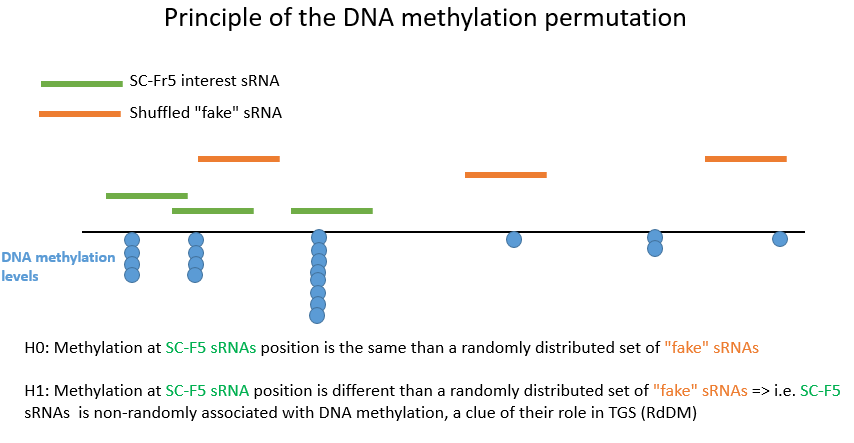
We assess the level of methylation at the mapping sites of the F5-SC sRNAs and compare it to the level of methylation at shuffled sequences following the size and number distribution of the F5-SC sRNAs and perform several times the shuffling to see if the methylation value observed for the sRNAs could be observed by chance compared to a random distribution.


```{bash, eval=FALSE}

bedGraph="pooled_SC_TEs.CX_report.filtered.sorted.bedGraph"
genome="concatenated_TEs.fa.fai"

# Concatenate 3x the sRNAs to have enough sRNAs with DNA methylation value for the permutation
cat F5_SC_20_24nt_mapping_concatenated_TEs.cleaned.with_meth.bed \
F5_SC_20_24nt_mapping_concatenated_TEs.cleaned.with_meth.bed \
F5_SC_20_24nt_mapping_concatenated_TEs.cleaned.with_meth.bed \
> F5_SC_20_24nt_mapping_concatenated_TEs.cleaned.with_meth.3x.bed

# Test if I have at least 575 sRNAs with DNA methylation values
for i in {1..10}; do
  #echo "Running permutation $i ..."
  bedtools shuffle -i F5_SC_20_24nt_mapping_concatenated_TEs.cleaned.with_meth.3x.bed \
  -g $genome | bedtools sort -i - > permutation_concatenated_TEs/perm_${i}.bed
  bedtools map -a permutation_concatenated_TEs/perm_${i}.bed \
  -b $bedGraph -c 4 -o mean | awk '{ if($4 != ".") {print $0} }' | wc -l
done
672
648
676
681
673
682
680
651
688
700

# Yes

# Do proper permutation 100 times
for i in {1..100}; do
  echo "Running permutation $i ..."
  bedtools shuffle -i F5_SC_20_24nt_mapping_concatenated_TEs.cleaned.with_meth.3x.bed \
  -g $genome | bedtools sort -i - > permutation_concatenated_TEs/perm_${i}.bed
  bedtools map -a permutation_concatenated_TEs/perm_${i}.bed -b $bedGraph -c 4 -o mean | \
    awk '{ if($4 != ".") {print $0} }' | head -n 483 | \
    awk '{ sum += $4; n++ } END { if (n > 0) print sum / n; }' >> \
      permutation_concatenated_TEs/average_meth_permutation.txt
    rm permutation_concatenated_TEs/perm_${i}.bed 
done

# Get average permutation across all permutations
awk '{ sum += $1; n++ } END { if (n > 0) print sum / n; }' \
permutation_concatenated_TEs/average_meth_permutation.txt
0.296864

```


```{r}
permutation_DNA_methylation <- as.vector(unlist(read.delim("data/average_meth_permutation.txt",
                                                           header = F, dec=",")))
observed_value <- as.double("0.325267")

df_DNA_meth_permutation <- as.data.frame(matrix(nrow=101, ncol=1))

names(df_DNA_meth_permutation) <- "value"

df_DNA_meth_permutation$value <- c(observed_value, unlist(permutation_DNA_methylation))
df_DNA_meth_permutation$value <- as.double(df_DNA_meth_permutation$value)

ggplot(df_DNA_meth_permutation, aes(x="",y=value*100)) + 
  geom_boxplot(outlier.shape = NA) + 
  geom_point(position=position_jitter()) + 
  theme_bw() + 
  ylab("% of DNA methylation") + 
  xlab("") + 
  ggtitle("Permutation DNA methylation TEs") +
  geom_hline(yintercept=32.5267) + 
  theme(axis.text.x = element_text(color="black"), 
        axis.text.y = element_text(color="black"),
        axis.ticks = element_line(color = "black")) + 
  theme(plot.title = element_text(hjust = 0.5)) + 
  scale_y_continuous(labels = scales::comma_format()) +  
  theme(axis.text.x = element_text(color="black"), 
      axis.text.y = element_text(color="black"),
      axis.ticks = element_line(color = "black")) + 
      theme(plot.title = element_text(hjust = 0.5)) + 
      scale_y_continuous(labels = scales::comma_format())

```

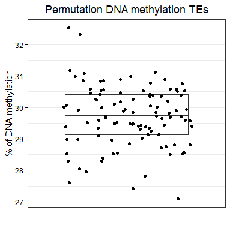

## Methylation at 45S rRNA


