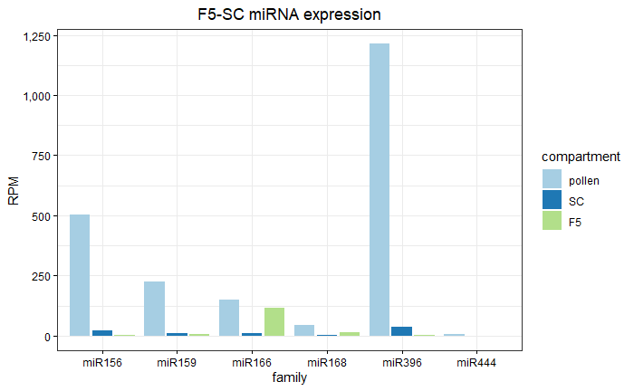

# Software dependencies

* sra-toolkit (v3.0.5)
* bedtools (v2.29.1)
* bismark (v0.24.2)
* Cleaveland (v4.5)
* cutadapt (v4.4)
* fastx (v0.0.14)
* bowtie (1.2.1.1)
* UNITAS (v1.8.0)
* samtools (v1.9)
* trim_galore (v.0.6.10) 
* R (v4.3.2)
* seqkit (v2.5.1)

# R libraries

* DESeq2 (v1.28.1)

```{r}
library("tidyverse")
library("DESeq2")
library("ggplot2")
library("ggpubr")
library("gghighlight")
library("DESeq2")
library("Biostrings")
library("VennDiagram")

fasta_to_df <- function(path){
  fasta = readLines(path)
  ids = grepl(">", fasta)
  f = data.frame(
    id = sub(">", "", fasta[ids]),
    sequence = tapply(fasta[!ids], cumsum(ids)[!ids], function(x) {
      paste(x, collapse = "")
    }))
  return(f)
}

make_fasta <-  function(vector_sequence, path_output, sequence_names){
  if(is.vector(vector_sequence)){
    len_seq <- length(vector_sequence)
    Xfasta <- character(len_seq * 2)
    if(missing(sequence_names)){
      Xfasta[c(TRUE, FALSE)] <- paste0(">seq", 1:len_seq)
    } else {
      Xfasta[c(TRUE, FALSE)] <- sequence_names
    }
    Xfasta[c(FALSE, TRUE)] <- as.character(vector_sequence)
    writeLines(Xfasta, path_output)
  } 
  else {
      stop("Argument is not a vector")
    }
}

# Source function for GO analysis
source("S:/git_repositories/GOMAP_maize_B73_NAM5/go_functions.R", chdir = T)
```


# Data availability

All data can be download on NCBI (PRJNA1077103)

| accession   | library_ID       | Type      |
|-------------|------------------|-----------|
| SRR28009046 | 70SC_BS          | PBAT      |
| SRR28009045 | 84SC_BS          | PBAT      |
| SRR28009041 | 87SC_BS          | PBAT      |
| SRR28009040 | F5_rep1_sRNA     | sRNA-seq  |
| SRR28009039 | F5_rep2_sRNA     | sRNA-seq  |
| SRR28009038 | F5_rep3_sRNA     | sRNA-seq  |
| SRR28009037 | pollen_rep1_sRNA | sRNA-seq  |
| SRR28009044 | pollen_rep2_sRNA | sRNA-seq  |
| SRR28009036 | SC_rep1_sRNA     | sRNA-seq  |
| SRR28009035 | SC_rep2_sRNA     | sRNA-seq  |
| SRR28009043 | SC_rep3_sRNA     | sRNA-seq  |
| SRR28009042 | pollen_degradome | Degradome |

Download the raw fastq files using [sra-tools](https://github.com/ncbi/sra-tools/wiki) (see tutorial in https://github.com/johanzi/ncbi_tutorial).

*PBAT: Post-bisulfite adapter tagging bisulfite-sequencing.*

Download SRR_Acc_List.txt using the SRA Run selector and download the fastq files.

```{bash, eval=FALSE}
module load sratoolkit

while read name; do
        fastq-dump --split-files $name
done < SRR_Acc_List.txt

```


# sRNA analysis

## Trimming

Sperm cell and pollen data (SRR28009037, SRR28009044, SRR28009036, SRR28009035, SRR28009043). These libraries were made with NEBNext small RNA kit (NEB, cat. no. E7300).

```{bash, eval=FALSE}
cutadapt -a agatcggaagagcacacgtct --discard-untrimmed <fastq.fq.gz> | \
  cutadapt -m 18 -M 37 -o <fastq.trimmed.fq.gz> -
```

Vesicles fraction 5 (F5) data (SRR28009040, SRR28009039, SRR28009038). sRNA-seq libraries for these samples were made with the Small-seq protocol (Hagemann-Jensen et al. 2018). The trimming is different here because unique molecular identifiers (UMI) are present.

```{bash, eval=FALSE}
# Remove 3' adapter
cutadapt -a tggaattctcgggtgccaagg --discard-untrimmed <fastq.fq.gz> | \
  cutadapt -m 18 -o <fastq.trimmed.fq.gz> -

# Collapse reads with the same UMI
zcat <fastq.trimmed.fq.gz> | fastx_collapser -o <collapsed.fa>

# Remove UMI sequence
cutadapt -g ^NNNNNNNNCA --discard-untrimmed <collapsed.fa> | \
  cutadapt -m 18 -M 37 -o <collapsed.trimmed_UMI.fa> -

```


## sRNA mapping

We consider only sRNAs mapping without mismatch to the B73 NAM5 assembly (chromosomes, scaffolds, and organelles). Fasta file was obtained on https://download.maizegdb.org/Zm-B73-REFERENCE-NAM-5.0/Zm-B73-REFERENCE-NAM-5.0.fa.gz

```{bash, eval=FALSE}
# Collapse the sequences
fastx_collapser -i <input_reads> -o <collapsed.fa>

# Get B73 NAM5 genome (chromosomes and contigs)
wget https://download.maizegdb.org/Zm-B73-REFERENCE-NAM-5.0/Zm-B73-REFERENCE-NAM-5.0.fa.gz

# Get chloroplast sequence (KF241981.1, https://www.ncbi.nlm.nih.gov/nuccore/KF241981)

# Get mitochondrial sequence (AY506529.1, https://www.ncbi.nlm.nih.gov/nuccore/AY506529.1)

# Concatenate all fasta sequences
cat Zm-B73-REFERENCE-NAM-5.0.fa chloroplast.fa mitochondria.fa > NAM5_Pt_Mt.fa

# Index genome
bowtie-build -f NAM5_Pt_Mt.fa index_Zm_B73_NAM5 

# Map the reads without any mismatch allowed
bowtie -S -l 37 -n 0 -x index_Zm_B73_NAM5 --threads 8 -f <collapsed.fa> | \
  samtools sort | samtools view -b -o <mapped_reads.bam> -

```


## Select sRNAs present in at least two replicates

We selected unique sRNAs found in at least 2/3 replicates for each tissue type (2/2 for pollen B73) and perform the intersect between sperm cell and fraction 5. `fastx_collapser` collapses sequences and add the number of time a given sequence is found. Therefore, sequences with a name containing 1, 2, or 3 are found in one, two, or three replicates, respectively.

```{bash, eval=FALSE}
# Convert mapped reads from bam to fasta
samtools fasta -F 4 <mapped_reads.bam> > <mapped_reads.fa>

# Concatenate reads of all replicates
cat mapped_reads_rep1.fa mapped_reads_rep2.fa mapped_reads_rep3.fa > pooled_rep.fa

# Rename to remove previous fastx_collapser naming
seqkit replace -p .+ -r "seq_{nr}" pooled_rep.fa > pooled_rep.renamed.fa

# Collapse reads
fastx_collapser -i pooled_rep.renamed.fa -o pooled_rep.renamed.collapsed.fa

# Keep reads with at least 2 replicates (remove read with 1 in the seq name)
seqkit grep -v -r -p -1 pooled_rep.renamed.collapsed.fa \ 
  > pooled_rep.renamed.collapsed.intersect_min_2.fa

```

```{bash, eval=FALSE}
# Retrieve mapped reads and convert to fasta
for i in mapped_fasta/*bam; do
  prefix=$(basename ${i%%.*})
  samtools fasta -F 4 $i > mapped_fasta/${prefix}.mapped.fa
done

# Pool reads across replicates
## Vesicle samples
while read i; do
  cat ${i}_*.fa > pooled_replicates/${i}.mapped.fa
done < <(\ls *.mapped.fa | cut -d_ -f1 | uniq)

## SC and pollen samples
while read i; do
  cat ${i}_*.fa > pooled_replicates/${i}.mapped.fa
done < <(\ls *.mapped.fa | cut -d_ -f1-2 | uniq)


# Rename to remove previous fastx_collapser naming
for i in pooled_replicates/*fa; do
  prefix=$(basename ${i%%.*})
  seqkit replace -p .+ -r "seq_{nr}" $i > pooled_replicates/${prefix}.mapped.renamed.fa
  rm $i
done

# Collapse again
for i in pooled_replicates/*renamed.fa; do
  prefix=$(basename ${i%%.*})
  fastx_collapser -i $i -o pooled_replicates/${prefix}.collapsed.fa
done

# Retrieve reads present in at least two replicates
for i in pooled_replicates/*.collapsed.fa; do
  prefix=$(basename ${i%%.*})
  seqkit grep -v -r -p -1 $i > pooled_replicates/${prefix}.intersect_min_2.fa
done

```


## Intersect sRNAs between F5 and SC

```{bash, eval=FALSE}
# Pool unique sequences from 2 tissues
cat Fr5.intersect_min_2.fa SC_B73.intersect_min_2.fa > pooled_SC_Fr5.fa

# Rename headers
seqkit replace -p .+ -r "seq_{nr}" pooled_SC_Fr5.fa > pooled_SC_Fr5.renamed.fa
rm pooled_SC_Fr5.fa

# Collapse reads
fastx_collapser -i pooled_SC_Fr5.renamed.fa -o pooled_SC_Fr5.renamed.collapsed.fa

# Retrieve sequences that are in both tissue
seqkit grep -v -r -p -1 pooled_SC_Fr5.renamed.collapsed.fa > pooled_SC_Fr5.intersect.fa

seqkit stats pooled_SC_Fr5.intersect_min_2.fa
file                              format  type  num_seqs  sum_len  min_len  avg_len  max_len
pooled_SC_Fr5.intersect_min_2.fa  FASTA   DNA     22,408  609,987       18     27.2       37

```

22,408 common sequences found between SC and Pollen.


# Expression analysis

To perform the PCA of sRNAs expression across the three types compartments, we considered every sRNA sequence has a gene and looked at the read count across all samples. We gathered these raw read count into a matrix that can then be processed into DESeq2 as a standard gene read count matrix.

## Format data

Use collapsed reads by `fastx_collapser` which gives the sequence and the number of times it occurs in a given sample with the number of occurences within the fasta header.

Example:

```
>1-460089
TGCAAATCTAACGAAGTGCTCCTGGACG
>2-206928
CGTTATTTTACTTATTCCGTGGGTCGGAAGCGGGGCA
>3-195873
TTAACACATGCAAATCTAACGAAGTGCTCCTGGACG
```
The first sequence `TGCAAATCTAACGAAGTGCTCCTGGACG` occurs 460,089 times.

Convert the fasta format so that the number of occurrences comes right after the sequence:

```
TGCAAATCTAACGAAGTGCTCCTGGACG 460089
CGTTATTTTACTTATTCCGTGGGTCGGAAGCGGGGCA 206928
TTAACACATGCAAATCTAACGAAGTGCTCCTGGACG 195873
```

```{bash, eval=FALSE}
# Format and sort data by sequence name
for i in *.collapsed.fa; do
  prefix=$(basename ${i%%.*})
  awk -v RS='\n>' -v ORS='\n>' -v OFS='' -F'\n' '{$1=$1 "\t"}1' $i | \
          awk 'BEGIN {FS = "-"}{print $2}' | awk '{print $2"\t"$1}' | \
          sed '$ d' | sort -k1,1  > $output/${prefix}.txt
done

```

## Merge data

Merge all raw read count into one large matrix with samples in columns and sequence in rows. We used a java script that creates a bash command using the unix function `join`. The bash script is then launched and the output files are `merged_dataset.csv` and `merged_dataset_with_header.csv`, the only difference being the added header in the latter.

```{bash, eval=FALSE}
# Convert underscore in hyphens so they suffix stay in the header
rename 's/_/-/' *txt
# Do it twice for the second underscore
rename 's/_/-/' *txt

# specific the absolute path (. for current directory creates a bug). 
# Don't forget the final slash
java -jar scripts/GenerateDatasetJoinShellScript/dist/GenerateDatasetJoinShellScript.jar \
    -fileEnding txt -directory /path/to/directory/

# Remove txt suffix that are added in header of the file
sed -i 's/\.txt//g' header.csv

bash merge_datasets.sh

```


## Filter read count

```{bash, eval=FALSE}
# Most sRNAs have a row sum of 1, indicating they are present in only one sample with one read count. 
# These are not going to help with the analysis so I can discard them
awk '{x=0;for(i=2;i<=NF;i++)x=x+$i} x>1 {print $0}' merged_dataset.csv > cts.txt

wc -l merged_dataset.csv
5634337

wc -l cts.txt
1836113
# about 3x less sRNAs after filtering

# I need to remove the name of the first column (sequence)
sed -i 's/sequence//' header.csv

# Put back underscores in header
sed -i 's/-/_/g' header.csv

# Add header
cat header.csv cts.txt > cts_with_header.txt

```

We end up with a total of 1,836,113 sRNAs across all three tissues.

Create coldata.txt text file:

```
sample tissue
F5_1   F5
F5_2   F5
F5_3   F5
SC_1   SC
SC_2   SC
SC_3   SC
pollen_1 pollen
pollen_2 pollen
```

## PCA small RNA expression

```{r}
# Import the cts matrix (not gene name is now the row name => required)
cts <- read.table("data/cts_with_header.txt", header=TRUE, row.names=1, check.names = FALSE)

# Create a more compact R object
saveRDS(cts,"data/cts.Rds")

cts <- readRDS("data/cts.Rds")

# Upload the coldata file
coldata <- read.table ("data/coldata.txt", header=T)

# Convert the variables into factors
# (https:/www.listendata.com/2015/05/converting-multiple-numeric-variables.html)
col_names <- names(coldata)
coldata[,col_names] <- lapply(coldata[,col_names] , factor)

### Check that sample names match in both files
all(colnames(cts) %in% coldata$sample)

```


```{r}
# Create a DESeqDataSet object
dds <- DESeqDataSetFromMatrix(countData = cts,
                              colData = coldata,
                              design= ~tissue)

# Variance stabilizing transformation
vsd <- vst(dds, blind=FALSE)

# Create PCA
pcaData <- plotPCA(vsd, intgroup=c("sample", "tissue"), returnData=TRUE)

# Get percentage variation
percentVar <- round(100 * attr(pcaData, "percentVar"))

p <- ggplot(pcaData, aes(PC1, PC2, color=tissue)) +  
  xlab(paste0("PC1: ",percentVar[1],"% variance")) + 
  ylab(paste0("PC2: ",percentVar[2],"% variance")) +  
  theme_bw() +  
  scale_color_manual(values=c("#b2df8a", "#a6cee3", "#1f78b4")) + 
  ggtitle("PCA sRNA expression") + 
  theme(axis.text.x = element_text(color="black"),
        axis.text.y = element_text(color="black"),
        axis.ticks = element_line(color = "black")) + 
  theme(plot.title = element_text(hjust = 0.5))

p + geom_point(size = 4)

```


## Reads per million analysis

Normalize raw read count into reads per million to compare samples with each other. Only small RNAs found in at least two biological replicates are considered.

Retrieve sRNAs with found in at least two biological replicates:

```{r}
# Retrieve rows with a maximum of 0 zero 
F5 <-  cts[,1:3]
F5_v <- !(rowSums(F5 == "0")>1)
F5_filtered <-  F5[F5_v,] 
F5 <- rowSums(F5_filtered[,1:3])

# Retrieve rows with a maximum of 1 zero 
SC <- cts[,4:6]
SC_v <- !(rowSums(SC == "0")>1)
SC_filtered <-  SC[SC_v,] 
SC <- rowSums(SC_filtered[,1:3])

# Retrieve rows with a maximum of 1 zero 
pollen <- cts[,7:8]
pollen_v <- !(rowSums(pollen == "0"))
pollen_filtered <-  pollen[pollen_v,] 
pollen <- rowSums(pollen_filtered[,1:2])
```

Do RPM normalization:

```{r}
# RPM normalization
F5_RPM <- F5/(sum(F5)/1000000)
SC_RPM <- SC/(sum(SC)/1000000)
pollen_RPM <- pollen/(sum(pollen)/1000000)

df_F5_RPM <- as.data.frame(F5_RPM)
df_F5_RPM$size <- nchar(rownames(df_F5_RPM))
df_F5_RPM$size <- as.factor(df_F5_RPM$size)
df_F5_RPM <- df_F5_RPM %>% rownames_to_column("sequence")
colnames(df_F5_RPM) <- c("sequence","RPM","size")

df_SC_RPM <- as.data.frame(SC_RPM)
df_SC_RPM$size <- nchar(rownames(df_SC_RPM))
df_SC_RPM$size <- as.factor(df_SC_RPM$size)
df_SC_RPM <- df_SC_RPM %>% rownames_to_column("sequence")
colnames(df_SC_RPM) <- c("sequence","RPM","size")

df_pollen_RPM <- as.data.frame(pollen_RPM)
df_pollen_RPM$size <- nchar(rownames(df_pollen_RPM))
df_pollen_RPM$size <- as.factor(df_pollen_RPM$size)
df_pollen_RPM <- df_pollen_RPM %>% rownames_to_column("sequence")
colnames(df_pollen_RPM) <- c("sequence","RPM","size")

# Check total number of unique sRNA sequences that are present in at least
# two biological replicates
sequence_min_2rep <- unique(c(df_F5_RPM$sequence, df_SC_RPM$sequence, df_pollen_RPM$sequence))
length(sequence_min_2rep)
# [1] 561915

# Save RDS
saveRDS(df_F5_RPM, "data/df_F5_RPM.Rds")
saveRDS(df_SC_RPM, "data/df_SC_RPM.Rds")
saveRDS(df_pollen_RPM, "data/df_pollen_RPM.Rds")

# Load RDS
df_F5_RPM <- readRDS("data/df_F5_RPM.Rds")
df_SC_RPM <- readRDS("data/df_SC_RPM.Rds")
df_pollen_RPM <- readRDS("data/df_pollen_RPM.Rds")


# Group dataframes per size to make plot faster
df_F5_RPM_size <- df_F5_RPM %>% group_by(size) %>% 
  summarize(RPM=sum(RPM), nb_sequence=n(), .groups='drop') %>% 
  arrange(RPM)

df_SC_RPM_size <- df_SC_RPM %>% group_by(size) %>% 
  summarize(RPM=sum(RPM), nb_sequence=n(), .groups='drop') %>% 
  arrange(RPM)

df_pollen_RPM_size <- df_pollen_RPM %>% group_by(size) %>% 
  summarize(RPM=sum(RPM), nb_sequence=n(), .groups='drop') %>% 
  arrange(RPM)

# Create a dataframes containing all 3 together
df_F5_RPM_size$tissue <- "F5"
df_SC_RPM_size$tissue <- "SC"
df_pollen_RPM_size$tissue <- "pollen"

df_F5_SC_pollen_RPM_size <- rbind(df_pollen_RPM_size, df_SC_RPM_size, df_F5_RPM_size)

df_F5_SC_pollen_RPM_size$tissue <- as.factor(df_F5_SC_pollen_RPM_size$tissue)

# order tissue
df_F5_SC_pollen_RPM_size$tissue <- factor(df_F5_SC_pollen_RPM_size$tissue, 
                                          levels=c("pollen","SC","F5"), ordered=T)

saveRDS(df_F5_SC_pollen_RPM_size, "data/df_F5_SC_pollen_RPM_size.Rds")

df_F5_SC_pollen_RPM_size <- readRDS("data/df_F5_SC_pollen_RPM_size.Rds")

```

We have a total of unique sRNA sequences of: 

* F5: 193,967
* SC: 128,639
* Pollen: 328,456
* Across all three tissues: 561,915


## sRNA expression overview

```{r}

ggplot(df_F5_SC_pollen_RPM_size, aes(x=size, y=RPM, group=tissue, color=tissue)) + 
  geom_point() +  
  geom_line() + 
  theme_bw() + 
  ylab("RPM") + 
  xlab("Size in nt") + 
  scale_color_manual(values=c("#a6cee3", "#1f78b4", "#b2df8a"))  + 
  ggtitle("sRNAs expression overview") +  
  theme(axis.text.x = element_text(color="black"),
        axis.text.y = element_text(color="black"),
        axis.ticks = element_line(color = "black")) + 
  theme(plot.title = element_text(hjust = 0.5)) 

```


## Intersect F5-SC

```{r}

F5_SC_overlap <- intersect(df_F5_RPM$sequence, df_SC_RPM$sequence)

df_F5_RPM_F5_SC <- df_F5_RPM %>% filter(sequence %in% F5_SC_overlap)
saveRDS(df_F5_RPM_F5_SC, "data/df_F5_RPM_intersect.Rds")

df_SC_RPM_F5_SC <- df_SC_RPM %>% filter(sequence %in% F5_SC_overlap)
saveRDS(df_SC_RPM_F5_SC, "data/df_SC_RPM_intersect.Rds")

```

22,408 sRNAs are found in both SC and F5.


```{r}

df_F5_RPM_F5_SC_size <- df_F5_RPM_F5_SC  %>% group_by(size) %>% 
  summarize(RPM=sum(RPM), nb_sequence=n(), .groups='drop') %>% 
  arrange(RPM)

df_SC_RPM_F5_SC_size <-  df_SC_RPM_F5_SC %>% group_by(size) %>% 
  summarize(RPM=sum(RPM), nb_sequence=n(), .groups='drop') %>% 
  arrange(RPM)
  
# Create a dataframes containing all 3 together
df_F5_RPM_F5_SC_size$tissue <- "F5"
df_SC_RPM_F5_SC_size$tissue <- "SC"

df_F5_SC_RPM_F5_SC_size <- rbind(df_F5_RPM_F5_SC_size, df_SC_RPM_F5_SC_size)

df_F5_SC_RPM_F5_SC_size$tissue <- as.factor(df_F5_SC_RPM_F5_SC_size$tissue)

# order tissue
df_F5_SC_RPM_F5_SC_size$tissue <- factor(df_F5_SC_RPM_F5_SC_size$tissue, 
                                          levels=c("pollen","SC","F5"), ordered=T)

ggplot(df_F5_SC_RPM_F5_SC_size, aes(x=size, y=RPM, group=tissue, color=tissue)) + 
  geom_point() +  
  geom_line() + 
  theme_bw() + 
  ylab("RPM") + 
  xlab("Size in nt") + 
  scale_color_manual(values=c("#1f78b4", "#b2df8a"))  + 
  ggtitle("RPM F5-SC (n=22,408)") +  
  theme(axis.text.x = element_text(color="black"),
        axis.text.y = element_text(color="black"),
        axis.ticks = element_line(color = "black")) + 
  theme(plot.title = element_text(hjust = 0.5)) 

```


Venn Diagram of the overlap with SC sRNAs:

```{r}
grid.newpage()
draw.pairwise.venn(area1 = 193967, area2 = 128639, cross.area = 22408, category = c("F5","SC"), 
                   lty="blank", fill = c("#b2df8a","#a6cee3"))
```


## Permutation overlap F5-pollen

```{r}

perm <- function(sRNA_F5, sRNA_pollen, n) {
  result <- list()
  nb_sRNA_SC <- 128639
  
  for (i in 1:n) {
    pollen_resampled <- sample(sRNA_pollen, size = nb_sRNA_SC)
    intersection <- length(intersect(sRNA_F5, pollen_resampled))
    result[[i]] <- intersection
  }
  return(result)
}

permutation_results <- perm(df_F5_RPM$sequence, df_pollen_RPM$sequence, 1000)

```


```{r}
# Create dataframe to plot the results
df_permutation <- data.frame(matrix(nrow = 1001, ncol = 1))
names(df_permutation) <- c("value")

F5_SC_intersect <- 22408

df_permutation$value <- c(F5_SC_intersect, unlist(permutation_results))

boxplot(df_permutation$value, ylab="Number of intersecting sRNAs", col = "white", 
        main="Intersect permuted 128,639 sRNAs from pollen with F5 sRNAs", 
        outline = F, ylim=c(8000,23000))
stripchart(df_permutation$value,              # Data
           method = "jitter", # Random noise
           pch = 18,          # Pch symbols
           col = "black",           # Color of the symbol
           vertical = TRUE,   # Vertical mode
           add = TRUE)        # Add it over
abline(h = F5_SC_intersect, col="red")

```


The F5-SC intersect oof 22,408 sRNAs is high above the distribution of the intersect of the 193,967 F5 sRNAs with a permuted distribution of 128,639 pollen sRNAs. The overlap with SC is therefore highly significant.


## sRNAs mapping tRNAs

Use gtrnad database (http://gtrnadb.ucsc.edu/GtRNAdb2/genomes/eukaryota/Zmays7/) and download the High confidence mature tRNA sequences (zeaMay7-mature-tRNAs.fa).

Prepare a fasta file with the 561,915 unique sRNA sequences present in at least 2 replicates across all 3 tissue types.

```{r}
# Extract all sequences from the expression matrix
sequences <- rownames(cts)

# Convert into a fasta file
make_fasta(vector_sequence = sequence_min_2rep, path_output = "data/all_sRNAs_18_37nt.fa")

```


```{bash, eval=FALSE}
# Note that the version is frequently changed so this annotation is not available anymore
# Check the current version for maize on the website or use the Zmays7 provided in data
wget http://gtrnadb.ucsc.edu/GtRNAdb2/genomes/eukaryota/Zmays7/zeaMay7-mature-tRNAs.fa

seqkit stats *fa
file                       format  type  num_seqs  sum_len  min_len  avg_len  max_len
zeaMay7-mature-tRNAs.fa    FASTA   RNA        821   61,056       71     74.4       88

# Convert U to T
sed '/^[^>]/s/U/T/g' zeaMay7-mature-tRNAs.fa > zeaMay7-mature-tRNAs_U_to_T.fa

# Build the bowtie index
bowtie-build -f zeaMay7-mature-tRNAs_U_to_T.fa zeaMay7_mature_tRNAs

# Map all sRNAs without mismatches allowed
bowtie -n 0 -S --threads 16 zeaMay7_mature_tRNAs -f all_sRNAs_18_37nt.fa  | \
    samtools sort | \
    samtools view -bS -F4 -o tRNA_mapped_sRNAs.bam &

# reads processed: 561915
# reads with at least one reported alignment: 5063 (0.90%)
# reads that failed to align: 556852 (99.10%)

# Recover seq names of the mapped sRNAs
samtools view tRNA_mapped_sRNAs.bam | cut -f1 > mapped_sRNA_seq.txt

# Recover from fasta file
seqkit grep -n -f mapped_sRNA_seq.txt all_sRNAs_18_37nt.fa > tRFs_18_37nt.fa

# Retrieve sequence name and tRNA codon
samtools view tRNA_mapped_sRNAs.bam | cut -f1,3 > tRNA_mapped_sRNAs_seq_codon.txt

# Keep only the codon name
while read i; do
gene=$(echo "$i" | cut -f2 | cut -d- -f2,3)
seq_name=$(echo "$i" | cut -f1)
sequence=$(grep -A1 -w ">$seq_name" tRFs_18_37nt.fa | grep -v ">")
echo $sequence $gene
done < tRNA_mapped_sRNAs_seq_codon.txt > tRFs_18_37nt_annotated.txt

# Replace spaces by tabs
cat tRFs_18_37nt_annotated.txt | tr -s " " '\t' > tRFs_18_37nt_annotated.tab.txt

```


```{r}

tRFs_18_37nt_annotate <- read.delim("data/tRFs_18_37nt_annotated.tab.txt", header=FALSE)

colnames(tRFs_18_37nt_annotate) <- c("sequence","tRNA")
tRFs_18_37nt_annotate <- tRFs_18_37nt_annotate %>% mutate_at(1:2, as_factor)

# Merge dataframe
df_F5_RPM_F5_SC_tRF <- merge(df_F5_RPM_F5_SC, tRFs_18_37nt_annotate, by="sequence")

# Export as a text file to put in Excel supp data
write_delim(df_F5_RPM_F5_SC_tRF, "data/df_F5_RPM_F5_SC_tRF.txt", delim="\t")

```

801 observations retrieved from the 5063 sRNAs mapping tRNA genes.

```{r}

df_F5_RPM_F5_SC_tRF_per_type <- df_F5_RPM_F5_SC_tRF %>% group_by(tRNA) %>% 
  summarize(RPM=sum(RPM)) %>% arrange(RPM)

# Reorganize tRNA by decreasing RPM
df_F5_RPM_F5_SC_tRF_per_type$tRNA <- factor(df_F5_RPM_F5_SC_tRF_per_type$tRNA,
  levels=df_F5_RPM_F5_SC_tRF_per_type$tRNA[order(df_F5_RPM_F5_SC_tRF_per_type$RPM, decreasing = TRUE)])

# frequence RPM for each category
# tapply(df_F5_RPM_F5_SC_tRF_per_type$RPM, df_F5_RPM_F5_SC_tRF_per_type$tRNA,
# sum, na.rm = TRUE)/sum(df_F5_RPM_F5_SC_tRF_per_type$RPM)

# Get freq visible in %
# round(sort(tapply(df_F5_RPM_F5_SC_tRF_per_type$RPM, 
# df_F5_RPM_F5_SC_tRF_per_type$tRNA, sum, na.rm = TRUE)/sum(df_F5_RPM_F5_SC_tRF_per_type$RPM), 
# decreasing=T)*100, 2)

# The 6 first codons are above 2%, all are below 0.31%
# round(sort(tapply(df_F5_RPM_F5_SC_tRF_per_type$RPM, 
# df_F5_RPM_F5_SC_tRF_per_type$tRNA, sum, na.rm = TRUE)/1000000, decreasing=T)*100, 2)

# Keep in descending order
top_6_tRNA <- df_F5_RPM_F5_SC_tRF_per_type %>% arrange(desc(RPM)) %>% select(tRNA) %>% head(6)

df_F5_RPM_F5_SC_tRF_top_6 <- df_F5_RPM_F5_SC_tRF %>% filter(tRNA %in% top_6_tRNA$tRNA)

# Order tRNA classes
df_F5_RPM_F5_SC_tRF_top_6$tRNA <- factor(df_F5_RPM_F5_SC_tRF_top_6$tRNA, 
                                         levels=top_6_tRNA$tRNA, ordered=TRUE)


```


## Expression tDR top 6 F5

```{r}
# Restrict to 30-34 and summarize by group to avoid little lines within the plot
df_F5_RPM_F5_SC_tRF_top_6 %>% filter(size %in% c(30:34)) %>%  
  group_by(size,tRNA,  .groups='drop') %>% summarize(RPM=sum(RPM)) %>% 
  ggplot(aes(x=size, y=RPM, fill=tRNA)) + 
  geom_bar(stat="identity") + 
  theme_bw() + ylab("RPM") + 
  xlab("Size") + 
  ggtitle("Top 6 most expression F5-SC tDRs in F5") + 
  scale_fill_manual(values=c("#e41a1c","#377eb8","#4daf4a","#984ea3","#ff7f00","#ffff33"))+
  theme(axis.text.x = element_text(color="black"),axis.text.y = element_text(color="black"),
        axis.ticks = element_line(color = "black")) + 
  theme(plot.title = element_text(hjust = 0.5)) + 
  scale_y_continuous(labels = scales::comma_format())
```


Expression of tDRs in F5, SC, and pollen


## F5 tDRs expression

```{r}
# Merge dataframe
df_F5_RPM_tRF <- merge(df_F5_RPM, tRFs_18_37nt_annotate, by="sequence")

df_F5_RPM_tRF_per_type <- df_F5_RPM_tRF %>% group_by(tRNA) %>% 
  summarize(RPM=sum(RPM)) %>% arrange(RPM)

# Reorganize tRNA by decreasing RPM_sum
df_F5_RPM_tRF_per_type$tRNA <- factor(df_F5_RPM_tRF_per_type$tRNA, levels=df_F5_RPM_tRF_per_type$tRNA[order(df_F5_RPM_tRF_per_type$RPM, decreasing = TRUE)])

df_F5_RPM_tRF_per_type %>% arrange(desc(RPM)) %>% head(10) %>% ggplot(aes(x=tRNA, y=RPM, fill=tRNA)) +
  geom_bar(stat="identity", fill="grey") + 
  theme_bw() + 
  ylab("RPM") + 
  xlab("tRNA gene mapped") + 
  ggtitle("RPM F5 mapping tRNA, F5 expression") + 
  theme(axis.text.x = element_text(color="black"),
        axis.text.y = element_text(color="black"),
        axis.ticks = element_line(color = "black")) + 
  theme(plot.title = element_text(hjust = 0.5)) + 
  scale_y_continuous(labels = scales::comma_format())

```


## SC tDRs expression

```{r}
# Merge dataframe
df_SC_RPM_tRF <- merge(df_SC_RPM, tRFs_18_37nt_annotate, by="sequence")

df_SC_RPM_tRF_per_type <- df_SC_RPM_tRF %>% group_by(tRNA) %>% 
  summarize(RPM=sum(RPM)) %>% arrange(RPM)

# Reorganize tRNA by decreasing RPM_sum
df_SC_RPM_tRF_per_type$tRNA <- factor(df_SC_RPM_tRF_per_type$tRNA, levels=df_SC_RPM_tRF_per_type$tRNA[order(df_SC_RPM_tRF_per_type$RPM, decreasing = TRUE)])

df_SC_RPM_tRF_per_type %>% arrange(desc(RPM)) %>% head(10) %>% ggplot(aes(x=tRNA, y=RPM, fill=tRNA)) +
  geom_bar(stat="identity", fill="grey") + 
  theme_bw() + 
  ylab("RPM") + 
  xlab("tRNA gene mapped") + 
  ggtitle("RPM SC mapping tRNA, SC expression") + 
  theme(axis.text.x = element_text(color="black"),
        axis.text.y = element_text(color="black"),
        axis.ticks = element_line(color = "black")) + 
  theme(plot.title = element_text(hjust = 0.5)) + 
  scale_y_continuous(labels = scales::comma_format())

```


## Pollen tDRs expression

```{r}
# Merge dataframe
df_pollen_RPM_tRF <- merge(df_pollen_RPM, tRFs_18_37nt_annotate, by="sequence")

df_pollen_RPM_tRF_per_type <- df_pollen_RPM_tRF %>% group_by(tRNA) %>% 
  summarize(RPM=sum(RPM)) %>% arrange(RPM)

# Reorganize tRNA by decreasing RPM_sum
df_pollen_RPM_tRF_per_type$tRNA <- factor(df_pollen_RPM_tRF_per_type$tRNA, levels=df_pollen_RPM_tRF_per_type$tRNA[order(df_pollen_RPM_tRF_per_type$RPM, decreasing = TRUE)])

df_pollen_RPM_tRF_per_type %>% arrange(desc(RPM)) %>% head(10) %>% ggplot(aes(x=tRNA, y=RPM, fill=tRNA)) +
  geom_bar(stat="identity", fill="grey") + 
  theme_bw() + 
  ylab("RPM") + 
  xlab("tRNA gene mapped") + 
  ggtitle("RPM pollen mapping tRNA, pollen expression") + 
  theme(axis.text.x = element_text(color="black"),
        axis.text.y = element_text(color="black"),
        axis.ticks = element_line(color = "black")) + 
  theme(plot.title = element_text(hjust = 0.5)) + 
  scale_y_continuous(labels = scales::comma_format())

```


## UNITAS analysis

Install UNITAS v1.8.0

```{bash, eval=FALSE}
# Installation
wget --no-check-certificate https://www.smallrnagroup.uni-mainz.de/software/unitas_1.8.0.pl

chmod 755 unitas_1.8.0.pl

cpan
install Archive::Extract
exit

# LWP::Protocol::https already installed 
perldoc -l LWP::Protocol::https

# Get maize database
perl unitas_1.8.0.pl  -refdump -species Zea_mays

```

Get the TE annotation from B73 NAM5:

```{bash, eval=FALSE}
# Integrate TE annotation in UNITAS output

# Download B73 NAM5 TE annotation
wget https://raw.githubusercontent.com/oushujun/MTEC/master/maizeTE02052020

# I just need to add the prefix "TE|" so that Unitas 
# classifies the mapped sRNAs in the TE category
seqkit replace -p ^ -r "TE|" maizeTE02052020.fa > maizeTE02052020_renamed.fa

```

Add TE annotation using the `-refseq` argument. Unitas requires a fasta file with header having the type first, followed by pipe sign.

```{bash, eval=FALSE}
# Rename headers of input fasta file with a running number to avoid issue with UNITAS
seqkit replace -p .+ -r "seq_{nr}" all_sRNAs_18_37nt.fa > all_sRNAs_18_37nt.renamed.fa

perl unitas_1.8.0.pl -input all_sRNAs_18_37nt.renamed.fa \
    -refseq maizeTE02052020_renamed.fa -species Zea_mays

# UNITAS creates a folder with the HTML reports and all output files of the analysis

```


At the time of the analysis, here are the different versions of the databases we had:

```
SeqMap version/date: ...................... 1.0.13
Genomic tRNA database version/date: ....... 24.01.2019 (dd.mm.yyyy)
piRNA cluster database version/date: ...... 20.10.2023 (dd.mm.yyyy)
Ensembl version/date: ..................... Release 96
EnsemblGenomes version/date: .............. Release 43
tRF-1 sequence data version/date: ......... 09.04.2019 (dd.mm.yyyy)
tRNA-leader sequence data version/date: ... 09.04.2019 (dd.mm.yyyy)
SILVA rRNA (SSU) database version/date: ... Release 132
miRBase database version/date: ........ Release 22
SeqMap version/date: ...................... 1.0.13
```

## sRNA expression by category

Use the annotation derived from the mapping on the gtrnadb tRNA database and UNITAS to display the type of sRNA expressed.

```{r}

# Download fasta sequences annotated as rRNA by UNITAS
df_rRFs <- fasta_to_df("data/unitas/fasta/unitas.rRNA.fas")

df_F5_RPM_F5_SC_tRF_rRF <- df_F5_RPM_F5_SC %>% 
  mutate(category=ifelse((sequence %in% tRFs_18_37nt_annotate$s), 
                         "tRNA", ifelse((sequence %in% df_rRFs$s), "rRNA","others")))

df_F5_RPM_F5_SC_tRF_rRF$category <- as.factor(df_F5_RPM_F5_SC_tRF_rRF$category)

df_F5_RPM_F5_SC_tRF_rRF_size <- df_F5_RPM_F5_SC_tRF_rRF %>% 
  group_by(size, category) %>% 
  summarize(RPM=sum(RPM), nb_sequence=n(), .groups='drop') %>% 
  arrange(RPM)

# Move categories around
# Change order of the samples for plotting
df_F5_RPM_F5_SC_tRF_rRF_size$category <- factor(df_F5_RPM_F5_SC_tRF_rRF_size$category, 
                                                levels = c("rRNA", "tRNA","others"))


ggplot(df_F5_RPM_F5_SC_tRF_rRF_size, aes(x=size, y=RPM, fill=category)) + 
  geom_bar(stat="identity") + 
  theme_bw() + ylab("RPM") + 
  xlab("Size") + 
  ggtitle("F5-SC sRNAs expression in F5 (n=22,408)") + 
  scale_fill_manual(values=c("#d8b365", "#998ec3","#5ab4ac")) + 
  theme(plot.title = element_text(hjust = 0.5))  +
  theme(axis.text.x = element_text(color="black"),
        axis.text.y = element_text(color="black"),
        axis.ticks = element_line(color = "black"))+ 
  scale_y_continuous(labels = scales::comma_format()) 

```


## Analysis TEs

### Mapping

Use the maizeTE02052020 file used in UNITAS.

```{bash, eval=FALSE}

module load fastx bowtie samtools 

index="/usr/users/zicola/genomes/maize_B73/B73_NAM5/TE_NAM5_annotations/TE_bowtie1_index/maizeTE02052020"

srun --time=00:05:00 -c 16 --mem=20Gb bowtie -S -n 0 -l 37 $index --threads 16 -f all_sRNAs_18_37nt.fa | samtools sort | samtools view -F4 -b -o all_sRNAs_18_37nt_TEs.bam -

# reads processed: 561915
# reads with at least one reported alignment: 76739 (13.66%)
# reads that failed to align: 485176 (86.34%)

# Make a fasta file
samtools view -b all_sRNAs_18_37nt_TEs.bam | samtools bam2fq | fastq_to_fasta -i - -o all_sRNAs_18_37nt_TEs.fa

# Create a dictionary (seq name and TE name
samtools view all_sRNAs_18_37nt_TEs.bam | cut -f1,3 > seq_2_TE.txt
cut -d'#' -f2 seq_2_TE.txt > family
paste seq_2_TE.txt family > seq_2_TE_family.txt

```


```{r}

# Import fasta
df_TEs <- fasta_to_df("data/all_sRNAs_18_37nt_TEs.fa")

# Import database
seq_2_TE_family <- read.delim("data/seq_2_TE_family.txt", header=FALSE)

colnames(seq_2_TE_family) <- c("id","TE","TE_family")

df_TEs_annotated <- merge.data.frame(df_TEs, seq_2_TE_family, by="id")

```


```{r}
# F5-SC intersect in F5
df_F5_RPM_F5_SC <- readRDS("data/df_F5_RPM_intersect.Rds")

df_F5_RPM_F5_SC_TE <- merge.data.frame(df_TEs_annotated, df_F5_RPM_F5_SC, by="sequence")
# 594

# F5
df_F5_RPM <- readRDS("data/df_F5_RPM.Rds")

df_F5_RPM_TE <- merge.data.frame(df_TEs_annotated, df_F5_RPM, by="sequence")

# SC
df_SC_RPM <- readRDS("data/df_SC_RPM.Rds")

df_SC_RPM_TE <- merge.data.frame(df_TEs_annotated, df_SC_RPM, by="sequence")
# 5130

# Pollen
df_pollen_RPM <- readRDS("data/df_pollen_RPM.Rds")

df_pollen_RPM_TE <- merge.data.frame(df_TEs_annotated, df_pollen_RPM, by="sequence")
# 63851

```


### Relative expression per sRNA size

```{r}

df_pollen_RPM_TE_size <- df_pollen_RPM_TE %>% group_by(size) %>% 
  summarize(RPM=sum(RPM), nb_sequence=n(), .groups='drop') %>% 
  arrange(RPM)

df_pollen_RPM_TE_size$percent <- df_pollen_RPM_TE_size$RPM/sum(df_pollen_RPM_TE_size$RPM)

df_SC_RPM_TE_size <- df_SC_RPM_TE %>% group_by(size) %>% 
  summarize(RPM=sum(RPM), nb_sequence=n(), .groups='drop') %>% 
  arrange(RPM)

df_SC_RPM_TE_size$percent <- df_SC_RPM_TE_size$RPM/sum(df_SC_RPM_TE_size$RPM)

df_F5_RPM_TE_size <- df_F5_RPM_TE %>% group_by(size) %>% 
  summarize(RPM=sum(RPM), nb_sequence=n(), .groups='drop') %>% arrange(RPM)

df_F5_RPM_TE_size$percent <- df_F5_RPM_TE_size$RPM/sum(df_F5_RPM_TE_size$RPM)

df_F5_RPM_F5_SC_TE_size <- df_F5_RPM_F5_SC_TE  %>% 
  group_by(size) %>% 
  summarize(RPM=sum(RPM), nb_sequence=n(), .groups='drop') %>% arrange(RPM)

df_F5_RPM_F5_SC_TE_size$percent <- df_F5_RPM_F5_SC_TE_size$RPM/sum(df_F5_RPM_F5_SC_TE_size$RPM)


df_pollen_RPM_TE_size$compartment <- "pollen"
df_SC_RPM_TE_size$compartment <- "SC"
df_F5_RPM_TE_size$compartment <- "F5"
df_F5_RPM_F5_SC_TE_size$compartment <- "F5-SC"

df_all_RPM_TE_size <- rbind(df_pollen_RPM_TE_size, 
                            df_SC_RPM_TE_size, df_F5_RPM_TE_size, df_F5_RPM_F5_SC_TE_size)

df_all_RPM_TE_size$compartment <- factor(df_all_RPM_TE_size$compartment, 
                                         levels = c("pollen","SC","F5","F5-SC"))


ggplot(df_all_RPM_TE_size, aes(x=size, y=percent, fill=compartment)) + 
  geom_bar(stat="identity", position="dodge2") + theme_bw() + 
  ylab("Percent RPM per size") + 
  xlab("Size") + 
  ggtitle("Relative expression of TE-mapped sRNAs per size") + 
  scale_y_continuous(labels=scales::percent) + 
  scale_fill_manual(values=c("#a6cee3", "#1f78b4", "#b2df8a","#33a02c")) + 
  theme(axis.text.x = element_text(color="black"),
        axis.text.y = element_text(color="black"),
        axis.ticks = element_line(color = "black")) + 
  theme(plot.title = element_text(hjust = 0.5)) 

```


### Relative expression per TE family

```{r}

df_F5_RPM_F5_SC_TE_per_family <- df_F5_RPM_F5_SC_TE %>% group_by(TE_family) %>% 
  summarize(RPM=sum(RPM), nb_sequence=n(), .groups='drop') 

df_F5_RPM_F5_SC_TE_per_family$TE_family <- factor(df_F5_RPM_F5_SC_TE_per_family$TE_family, 
levels = df_F5_RPM_F5_SC_TE_per_family$TE_family[order(df_F5_RPM_F5_SC_TE_per_family$RPM, decreasing = TRUE)])

df_F5_RPM_TE_per_family <- df_F5_RPM_TE %>% group_by(TE_family) %>% summarize(RPM=sum(RPM), nb_sequence=n(), .groups='drop') 

df_F5_RPM_TE_per_family$TE_family <- factor(df_F5_RPM_TE_per_family$TE_family, 
levels = df_F5_RPM_TE_per_family$TE_family[order(df_F5_RPM_TE_per_family$RPM, decreasing = TRUE)])

df_SC_RPM_TE_per_family <- df_SC_RPM_TE %>% group_by(TE_family) %>% 
  summarize(RPM=sum(RPM), nb_sequence=n(), .groups='drop') 

df_SC_RPM_TE_per_family$TE_family <- factor(df_SC_RPM_TE_per_family$TE_family, 
                                            levels = df_SC_RPM_TE_per_family$TE_family[order(df_SC_RPM_TE_per_family$RPM, decreasing = TRUE)])


df_pollen_RPM_TE_per_family <- df_pollen_RPM_TE %>% group_by(TE_family) %>% 
  summarize(RPM=sum(RPM), nb_sequence=n(), .groups='drop') 

df_pollen_RPM_TE_per_family$TE_family <- factor(df_pollen_RPM_TE_per_family$TE_family, 
levels = df_pollen_RPM_TE_per_family$TE_family[order(df_pollen_RPM_TE_per_family$RPM, decreasing = TRUE)])

df_F5_RPM_F5_SC_TE_per_family$compartment <- "F5-SC"
df_F5_RPM_TE_per_family$compartment <- "F5"
df_SC_RPM_TE_per_family$compartment <- "SC"
df_pollen_RPM_TE_per_family$compartment <- "pollen"

df_F5_RPM_F5_SC_TE_per_family$percent <- df_F5_RPM_F5_SC_TE_per_family$RPM/sum(df_F5_RPM_F5_SC_TE_per_family$RPM)
df_F5_RPM_TE_per_family$percent <- df_F5_RPM_TE_per_family$RPM/sum(df_F5_RPM_TE_per_family$RPM)
df_SC_RPM_TE_per_family$percent <- df_SC_RPM_TE_per_family$RPM/sum(df_SC_RPM_TE_per_family$RPM)
df_pollen_RPM_TE_per_family$percent <- df_pollen_RPM_TE_per_family$RPM/sum(df_pollen_RPM_TE_per_family$RPM)

df_all_RPM_TE_per_family <- rbind(df_F5_RPM_F5_SC_TE_per_family, 
                                  df_F5_RPM_TE_per_family, df_SC_RPM_TE_per_family, 
                                  df_pollen_RPM_TE_per_family)

df_all_RPM_TE_per_family$compartment <- factor(df_all_RPM_TE_per_family$compartment, 
                                               levels = c("pollen","SC","F5","F5-SC"))

ggplot(df_all_RPM_TE_per_family, aes(x=TE_family, y=percent, fill=compartment)) + 
  geom_bar(stat="identity", position="dodge") + 
  theme_bw() + 
  ylab("Percent RPM per compartment") + 
  xlab("TE family") +  
  ggtitle("Relative expression of TE-mapped sRNAs per TE family") + 
  theme(axis.text.x = element_text(angle=90, hjust=1)) +  
  theme(axis.text.x = element_text(color="black"),
        axis.text.y = element_text(color="black"),
        axis.ticks = element_line(color = "black")) + 
  theme(plot.title = element_text(hjust = 0.5)) + 
  scale_y_continuous(labels=scales::percent) +  
  scale_fill_manual(values=c("#a6cee3", "#1f78b4", "#b2df8a","#33a02c"))

```


## miRNA expression analysis


```{bash, eval=FALSE}

cd data/unitas/

cut -f1,2 unitas.miR-table_Zea_mays.txt > unitas.miR-table_Zea_mays.id_seq.txt

cut -f1 unitas.miR-table_Zea_mays.id_seq.txt | cut -d- -f1 | sed 's/[a-z]$//g' > unitas.miR-table_Zea_mays.id_seq_family.txt

paste unitas.miR-table_Zea_mays.id_seq.txt unitas.miR-table_Zea_mays.id_seq_family.txt > unitas.miR-table_Zea_mays.id_seq_family.all.txt

```

```{r}

df_unitas_miRNA_annotation <- read.delim("data/unitas/unitas.miR-table_Zea_mays.id_seq_family.all.txt")

colnames(df_unitas_miRNA_annotation) <- c("miRNA","sequence","family")
df_unitas_miRNA_annotation$family <- as.factor(df_unitas_miRNA_annotation$family)

# Remove all miRNAs with SNPs
df_unitas_miRNA_annotation <- df_unitas_miRNA_annotation %>% filter(!grepl("\\(", miRNA))

df_SC_RPM_miRNA <- merge.data.frame(df_SC_RPM, df_unitas_miRNA_annotation, by="sequence")
df_pollen_RPM_miRNA <- merge.data.frame(df_pollen_RPM, df_unitas_miRNA_annotation, by="sequence")
df_F5_RPM_miRNA <- merge.data.frame(df_F5_RPM, df_unitas_miRNA_annotation, by="sequence")
df_F5_RPM_F5_SC_RPM_miRNA <- merge.data.frame(df_F5_RPM_F5_SC, df_unitas_miRNA_annotation, by="sequence")

list_miRNA_df <- list(pollen=df_pollen_RPM_miRNA, SC=df_SC_RPM_miRNA, F5=df_F5_RPM_miRNA, F5_SC=df_F5_RPM_F5_SC_RPM_miRNA)

# Export df_F5_RPM_F5_SC_RPM_miRNA
#write_delim(df_F5_RPM_F5_SC_RPM_miRNA, "data/df_F5_RPM_F5_SC_RPM_miRNA.txt")


```


### Expression of F5-SC sRNAs across tissues

```{r}
summary_df <- function(df, name){
  df_family <- df %>% group_by(family) %>% summarize(RPM=sum(RPM))
  df_family$compartment <- name
  return(df_family)
}

df_pollen_RPM_miRNA_family <- summary_df(list_miRNA_df[[1]],"pollen")
df_SC_RPM_miRNA_family <- summary_df(list_miRNA_df[[2]],"SC")
df_F5_RPM_miRNA_family <- summary_df(list_miRNA_df[[3]],"F5")
df_F5_RPM_F5_SC_RPM_miRNA_family <- summary_df(list_miRNA_df[[4]],"F5_SC")


df_all_miRNA <- rbind(df_pollen_RPM_miRNA_family, df_SC_RPM_miRNA_family, 
                      df_F5_RPM_miRNA_family, df_F5_RPM_F5_SC_RPM_miRNA_family)

df_all_miRNA$compartment <- as.factor(df_all_miRNA$compartment)


summary_df_seq <- function(df, name){
  df$compartment <- name
  return(df)
}

df_pollen_RPM_miRNA_seq <- summary_df_seq(list_miRNA_df[[1]],"pollen")
df_SC_RPM_miRNA_seq <- summary_df_seq(list_miRNA_df[[2]],"SC")
df_F5_RPM_miRNA_seq <- summary_df_seq(list_miRNA_df[[3]],"F5")
df_F5_RPM_F5_SC_RPM_miRNA_seq <- summary_df_seq(list_miRNA_df[[4]],"F5_SC")

df_all_miRNA_seq <- rbind(df_pollen_RPM_miRNA_seq, df_SC_RPM_miRNA_seq, df_F5_RPM_miRNA_seq)


# Order compartments
df_all_miRNA$compartment <- factor(df_all_miRNA$compartment, levels = c("pollen", "SC", "F5", "F5_SC"))

# Sort by alphnumerical orders the miRNAs
sorted_family <- gtools::mixedsort(as.character(unique(df_all_miRNA$family)))

df_all_miRNA$family <- factor(df_all_miRNA$family, levels =sorted_family)

# Plot
ggplot(df_all_miRNA, aes(x=family, y=RPM, fill=compartment)) + 
  geom_bar(stat="identity", position="dodge2")+ 
  theme_bw()  + 
  ggtitle("F5-SC miRNA expression") + 
  theme(axis.text.x = element_text(color="black"),
        axis.text.y = element_text(color="black"),
        axis.ticks = element_line(color = "black")) + 
  theme(plot.title = element_text(hjust = 0.5)) + 
  scale_y_continuous(labels = scales::comma_format()) +  
  theme(axis.text.x = element_text(angle=90, hjust=1)) +  
  scale_fill_manual(values=c("#a6cee3", "#1f78b4", "#b2df8a","#33a02c"))

```


### Subset miRNAs in F5-SC

```{r}

# Get all F5_SC miRNA sequences
df_F5_SC_miRNA_seq <- df_all_miRNA_seq %>% filter(sequence %in% df_F5_RPM_F5_SC_RPM_miRNA$sequence)

# Summarize by family
df_F5_SC_RPM_miRNA_family <- df_F5_SC_miRNA_seq %>% group_by(family, compartment) %>% summarize(RPM=sum(RPM))

# Discard miR2118 because it is a prediction with mismatch
df_F5_SC_RPM_miRNA_family <-df_F5_SC_RPM_miRNA_family %>% filter(family!="miR2118")

# Sort miRNA
df_F5_SC_RPM_miRNA_family$family <- factor(df_F5_SC_RPM_miRNA_family$family, levels =c("miR156", "miR159", "miR166", "miR168", "miR396","miR444"))

df_F5_SC_RPM_miRNA_family$compartment <- factor(df_F5_SC_RPM_miRNA_family$compartment, levels =c("pollen", "SC", "F5"))

ggplot(df_F5_SC_RPM_miRNA_family, aes(x=family, y=RPM, fill=compartment)) + 
  geom_bar(stat="identity", position="dodge2")+
  ggtitle("F5-SC miRNA expression") +
  theme_bw()  + 
  theme(axis.text.x = element_text(color="black"),
        axis.text.y = element_text(color="black"),
        axis.ticks = element_line(color = "black")) + 
  theme(plot.title = element_text(hjust = 0.5)) + 
  scale_y_continuous(labels = scales::comma_format()) +  
  scale_fill_manual(values=c("#a6cee3", "#1f78b4", "#b2df8a"))

```





```{r}

plot_per_family <- function(df, title){
  df_family <- df %>% group_by(family) %>% summarize(RPM=sum(RPM))
  df_family$family <- factor(df_family$family, 
                             levels=df_family$family[order(df_family$RPM, decreasing = TRUE)])
  g1 <- df_family %>% arrange(desc(RPM)) %>% 
    ggplot(aes(x=family, y=RPM)) + 
    geom_bar(stat="identity") + 
    theme_bw() + ylab("RPM") + 
    xlab("miRNA family mapped") + 
    ggtitle(title) +  
    theme(axis.text.x = element_text(color="black"),
          axis.text.y = element_text(color="black"),
          axis.ticks = element_line(color = "black")) + 
    theme(plot.title = element_text(hjust = 0.5)) + 
    scale_y_continuous(labels = scales::comma_format()) + 
    theme(axis.text.x = element_text(angle=90, hjust=1))
  return(g1)
}

g1 <- plot_per_family(list_miRNA_df[[1]],"miRNA RPM pollen (n=121)")
g2 <- plot_per_family(list_miRNA_df[[2]],"miRNA RPM SC (n=42)")
g3 <- plot_per_family(list_miRNA_df[[3]],"miRNA RPM F5 (n=65)")
g4 <- plot_per_family(list_miRNA_df[[4]],"miRNA RPM F5-SC (n=20)")

ggarrange(g1,g2,g3,g4, nrow=2, ncol=2)

```


# Degradome analysis


# Sperm cell DNA methylation analysis


